# 🏗️ 兽了个兽 - 架构文档

> 本文档描述「兽了个兽」项目的系统架构、数据流、核心模块设计与关键决策。

---

## 一、系统架构总览

项目采用 Electron 三进程架构（主进程 / Preload 桥 / 渲染进程），游戏逻辑与 UI 解耦。


```mermaid
flowchart TB
    subgraph Main["主进程 Electron Main"]
        WIN["窗口管理<br/>800×1200 竖版"]
        DB["SQLite 数据层<br/>better-sqlite3"]
        IPC["IPC Handlers<br/>5个模块"]
        REPO["Repository<br/>CRUD"]
    end

    subgraph Preload["Preload 桥接层"]
        API["contextBridge<br/>window.gameAPI"]
    end

    subgraph Renderer["渲染进程 Vue 3"]
        UI["页面与组件<br/>5个视图 + 7个组件"]
        STORE["Pinia Stores<br/>game/settings/user"]
        ENGINE["Game Engine<br/>纯TS逻辑"]
        AUDIO["AudioManager<br/>Howler.js + ToneGenerator"]
    end

    WIN --> API
    API -->|ipcRenderer.invoke| IPC
    IPC --> REPO
    REPO --> DB
    UI <--> STORE
    STORE <--> ENGINE
    UI --> AUDIO
    UI --> API

    style Main fill:#2d4a3e,color:#ffffff
    style Preload fill:#5a3d2b,color:#ffffff
    style Renderer fill:#3a4d7a,color:#ffffff
```

### 三层职责

| 层 | 职责 | 技术 |
|---|---|---|
| **主进程** | 窗口管理、数据库读写、文件系统 | Electron + better-sqlite3 |
| **Preload** | 安全桥接，暴露受限 API | contextBridge |
| **渲染进程** | UI 渲染、游戏逻辑、状态管理 | Vue 3 + Pinia + 纯TS引擎 |

---

## 二、游戏引擎架构

游戏引擎位于 `src/game/`，是纯 TypeScript 实现，**不依赖 Vue 和 Electron**，可独立测试。

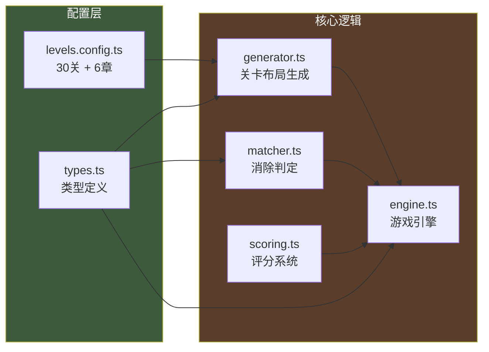
```mermaid
flowchart LR
    subgraph Config["配置层"]
        LV["levels.config.ts<br/>30关 + 6章"]
        TY["types.ts<br/>类型定义"]
    end

    subgraph Core["核心逻辑"]
        GEN["generator.ts<br/>关卡布局生成"]
        MATCH["matcher.ts<br/>消除判定"]
        ENG["engine.ts<br/>游戏引擎"]
        SCORE["scoring.ts<br/>评分系统"]
    end

    LV --> GEN
    TY --> GEN
    TY --> MATCH
    TY --> ENG
    GEN --> ENG
    MATCH --> ENG
    SCORE --> ENG

    style Config fill:#3d5a3d,color:#ffffff
    style Core fill:#5a3d2b,color:#ffffff
```

### 核心数据结构

```typescript
// 游戏运行时状态
interface GameState {
  mode: 'classic3' | 'classic4' | 'level'
  levelId?: number
  config: LevelConfig
  tiles: Tile[]           // 所有图案
  slots: Slot[]           // 底部槽位
  combo: number           // 当前连击
  maxCombo: number        // 最高连击
  score: number           // 当前分数
  props: GameProps        // 道具数量
  propsUsed: GameProps    // 已用道具
  history: HistoryEntry[] // 操作历史（撤回用）
  status: 'playing' | 'won' | 'lost'
  hintTileIds: number[]   // 提示高亮
  lastMatchedTileIds: number[] // 最近消除（动画用）
}

// 单个图案
interface Tile {
  id: number
  animal: AnimalType      // 12种动物之一
  variant: 0 | 1          // 2个变体
  layer: number            // 层级（0=最底）
  x: number; y: number    // 网格坐标
  coveredBy: number[]     // 被哪些tile覆盖
  removed: boolean         // 已消除
  inSlot: boolean          // 在槽位中
}
```

### 引擎方法（全部不可变更新）

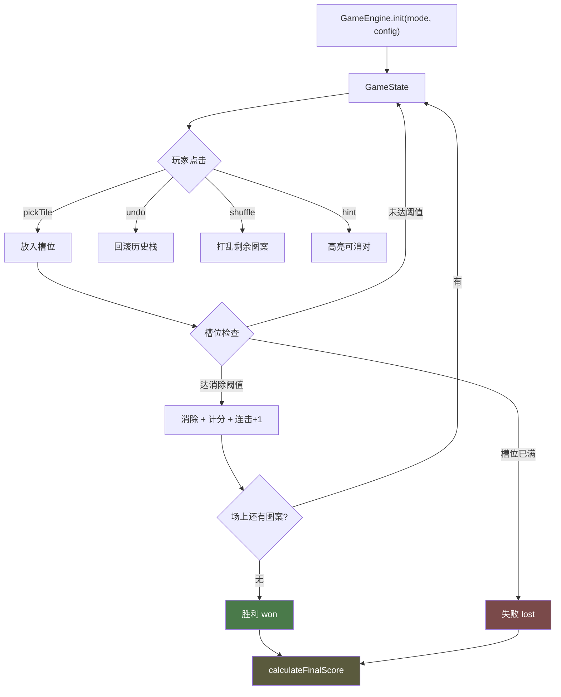
```mermaid
flowchart TD
    A["GameEngine.init(mode, config)"] --> B["GameState"]
    B --> C{"玩家点击"}
    C -->|pickTile| D["放入槽位"]
    D --> E{"槽位检查"}
    E -->|达消除阈值| F["消除 + 计分 + 连击+1"]
    E -->|未达阈值| B
    F --> G{"场上还有图案?"}
    G -->|有| B
    G -->|无| H["胜利 won"]
    E -->|槽位已满| I["失败 lost"]
    C -->|undo| J["回滚历史栈"]
    C -->|shuffle| K["打乱剩余图案"]
    C -->|hint| L["高亮可消对"]
    H --> M["calculateFinalScore"]
    I --> M

    style H fill:#4a7a4a,color:#ffffff
    style I fill:#7a4a4a,color:#ffffff
    style M fill:#5a5a3d,color:#ffffff
```

### 可解性保证算法

`generator.ts` 中的 `buildAnimalVariantList` 保证每个关卡的图案都能被消完：

1. 计算 `totalGroups = tiles / matchCount`
2. 枚举所有 `animal × variant` 组合（每章2种动物 × 2变体 = 4种）
3. 将组数均分到各组合，每组生成 `matchCount` 个相同 tile
4. 总数恰等于 `config.tiles`

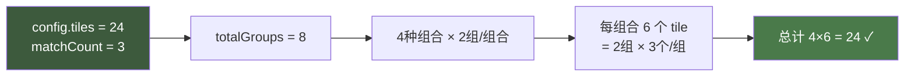
```mermaid
flowchart LR
    A["config.tiles = 24<br/>matchCount = 3"] --> B["totalGroups = 8"]
    B --> C["4种组合 × 2组/组合"]
    C --> D["每组合 6 个 tile<br/>= 2组 × 3个/组"]
    D --> E["总计 4×6 = 24 ✓"]

    style A fill:#3d5a3d,color:#ffffff
    style E fill:#4a7a4a,color:#ffffff
```

---

## 三、数据流架构

### 3.1 渲染层 ↔ 主进程通信

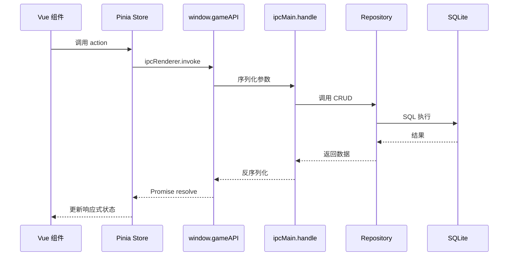
```mermaid
sequenceDiagram
    participant UI as Vue 组件
    participant Store as Pinia Store
    participant API as window.gameAPI
    participant IPC as ipcMain.handle
    participant Repo as Repository
    participant DB as SQLite

    UI->>Store: 调用 action
    Store->>API: ipcRenderer.invoke
    API->>IPC: 序列化参数
    IPC->>Repo: 调用 CRUD
    Repo->>DB: SQL 执行
    DB-->>Repo: 结果
    Repo-->>IPC: 返回数据
    IPC-->>API: 反序列化
    API-->>Store: Promise resolve
    Store-->>UI: 更新响应式状态
```

### 3.2 游戏点击流程

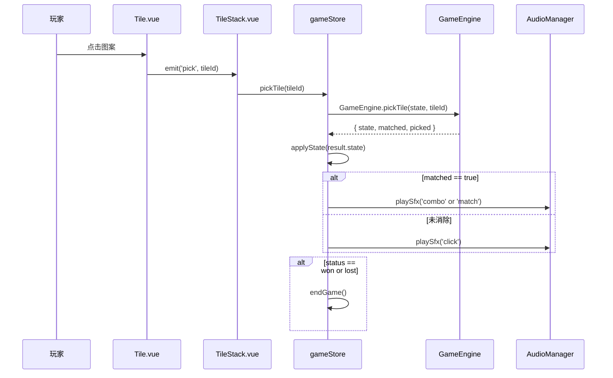
```mermaid
sequenceDiagram
    participant User as 玩家
    participant Tile as Tile.vue
    participant Stack as TileStack.vue
    participant Store as gameStore
    participant Engine as GameEngine
    participant Audio as AudioManager

    User->>Tile: 点击图案
    Tile->>Stack: emit('pick', tileId)
    Stack->>Store: pickTile(tileId)
    Store->>Engine: GameEngine.pickTile(state, tileId)
    Engine-->>Store: { state, matched, picked }
    Store->>Store: applyState(result.state)
    alt matched == true
        Store->>Audio: playSfx('combo' or 'match')
    else 未消除
        Store->>Audio: playSfx('click')
    end
    alt status == won or lost
        Store->>Store: endGame()
    end
```

---

## 四、数据库设计

### 4.1 Schema

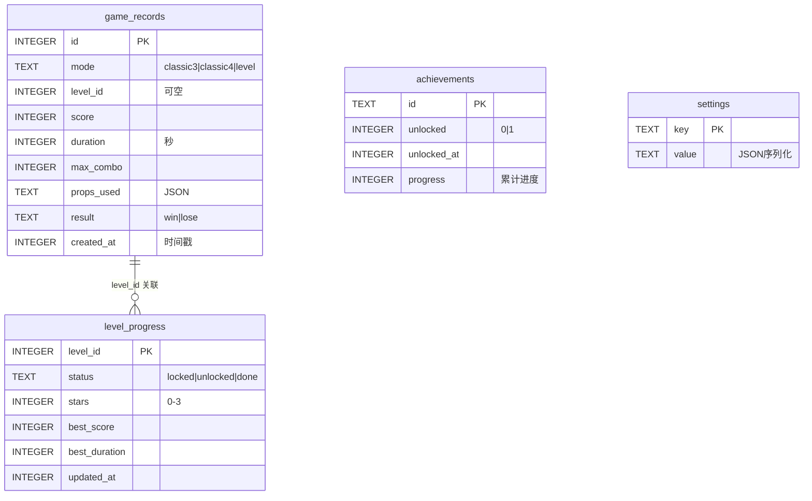
```mermaid
erDiagram
    game_records ||--o{ level_progress : "level_id 关联"
    game_records {
        INTEGER id PK
        TEXT mode "classic3|classic4|level"
        INTEGER level_id "可空"
        INTEGER score
        INTEGER duration "秒"
        INTEGER max_combo
        TEXT props_used "JSON"
        TEXT result "win|lose"
        INTEGER created_at "时间戳"
    }
    level_progress {
        INTEGER level_id PK
        TEXT status "locked|unlocked|done"
        INTEGER stars "0-3"
        INTEGER best_score
        INTEGER best_duration
        INTEGER updated_at
    }
    achievements {
        TEXT id PK
        INTEGER unlocked "0|1"
        INTEGER unlocked_at
        INTEGER progress "累计进度"
    }
    settings {
        TEXT key PK
        TEXT value "JSON序列化"
    }
```

### 4.2 数据库初始化流程

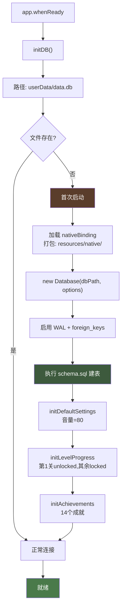
```mermaid
flowchart TD
    A["app.whenReady"] --> B["initDB()"]
    B --> C["路径: userData/data.db"]
    C --> D{"文件存在?"}
    D -->|否| E["首次启动"]
    E --> F["加载 nativeBinding<br/>打包: resources/native/"]
    F --> G["new Database(dbPath, options)"]
    G --> H["启用 WAL + foreign_keys"]
    H --> I["执行 schema.sql 建表"]
    I --> J["initDefaultSettings<br/>音量=80"]
    J --> K["initLevelProgress<br/>第1关unlocked,其余locked"]
    K --> L["initAchievements<br/>14个成就"]
    D -->|是| M["正常连接"]
    L --> M
    M --> N["就绪"]

    style E fill:#5a3d2b,color:#ffffff
    style I fill:#3d5a3d,color:#ffffff
    style N fill:#4a7a4a,color:#ffffff
```

### 4.3 首次启动初始化数据

| 表 | 初始化内容 |
|---|---|
| settings | `bgmVolume: 80`, `sfxVolume: 80` |
| level_progress | 30关，第1关 `unlocked`，其余 `locked` |
| achievements | 14个成就，全部 `unlocked: 0` |

---

## 五、30关章节结构

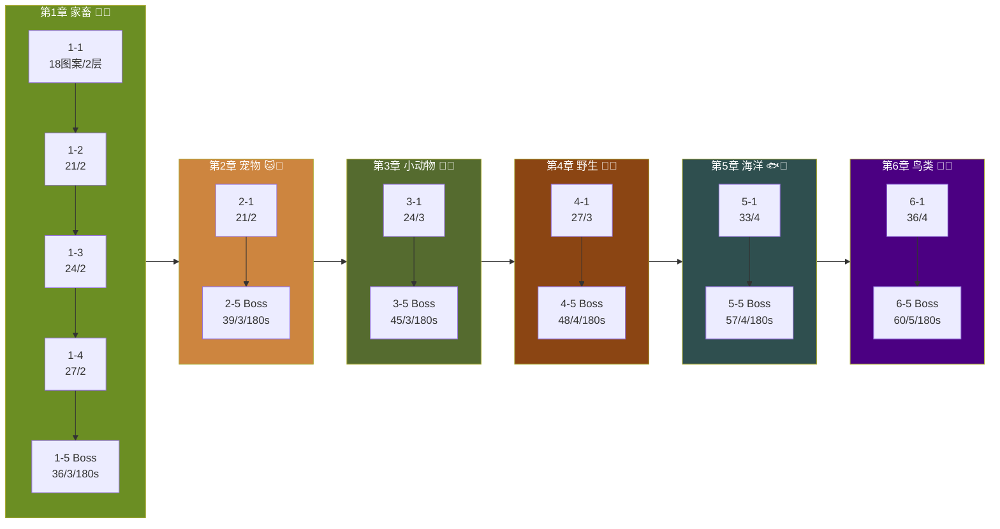
```mermaid
flowchart LR
    subgraph S1["第1章 家畜 🐑🐔"]
        L1["1-1<br/>18图案/2层"] --> L2["1-2<br/>21/2"]
        L2 --> L3["1-3<br/>24/2"]
        L3 --> L4["1-4<br/>27/2"]
        L4 --> L5["1-5 Boss<br/>36/3/180s"]
    end
    subgraph S2["第2章 宠物 🐱🐶"]
        L6["2-1<br/>21/2"] --> L10["2-5 Boss<br/>39/3/180s"]
    end
    subgraph S3["第3章 小动物 🐰🐹"]
        L11["3-1<br/>24/3"] --> L15["3-5 Boss<br/>45/3/180s"]
    end
    subgraph S4["第4章 野生 🐯🐻"]
        L16["4-1<br/>27/3"] --> L20["4-5 Boss<br/>48/4/180s"]
    end
    subgraph S5["第5章 海洋 🐟🐳"]
        L21["5-1<br/>33/4"] --> L25["5-5 Boss<br/>57/4/180s"]
    end
    subgraph S6["第6章 鸟类 🐤🦢"]
        L26["6-1<br/>36/4"] --> L30["6-5 Boss<br/>60/5/180s"]
    end

    S1 --> S2 --> S3 --> S4 --> S5 --> S6

    style S1 fill:#6b8e23,color:#ffffff
    style S2 fill:#cd853f,color:#ffffff
    style S3 fill:#556b2f,color:#ffffff
    style S4 fill:#8b4513,color:#ffffff
    style S5 fill:#2f4f4f,color:#ffffff
    style S6 fill:#4b0082,color:#ffffff
```

### 难度曲线

| 章节 | 普通关图案数 | Boss关图案数 | 层数 | 时间限制 |
|---|---|---|---|---|
| 1 | 18→27 | 36 | 2-3 | 无 |
| 2 | 21→30 | 39 | 2-3 | 无 |
| 3 | 24→33 | 45 | 3 | 无 |
| 4 | 27→36 | 48 | 3-4 | 无 |
| 5 | 33→42 | 57 | 4 | 无 |
| 6 | 36→45 | 60 | 4-5 | 无 |
| Boss | - | - | - | 180秒 |

---

## 六、评分系统

### 6.1 单次消除得分

```
单次得分 = matchCount × 10 + combo × 5
```

- `matchCount`：3消=3，4消=4
- `combo`：连击数（先+1再计分）

### 6.2 综合评分（局终）

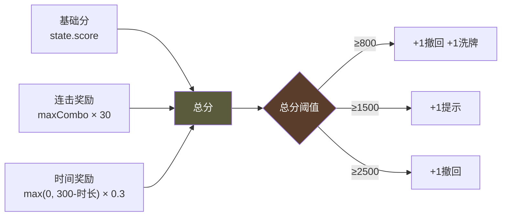
```mermaid
flowchart LR
    A["基础分<br/>state.score"] --> D["总分"]
    B["连击奖励<br/>maxCombo × 30"] --> D
    C["时间奖励<br/>max(0, 300-时长) × 0.3"] --> D
    D --> E{"总分阈值"}
    E -->|≥800| F["+1撤回 +1洗牌"]
    E -->|≥1500| G["+1提示"]
    E -->|≥2500| H["+1撤回"]

    style D fill:#5a5a3d,color:#ffffff
    style E fill:#5a3d2b,color:#ffffff
```

```
总分 = 基础分 × 0.5 + 连击奖励 + 时间奖励
```

---

## 七、道具系统设计

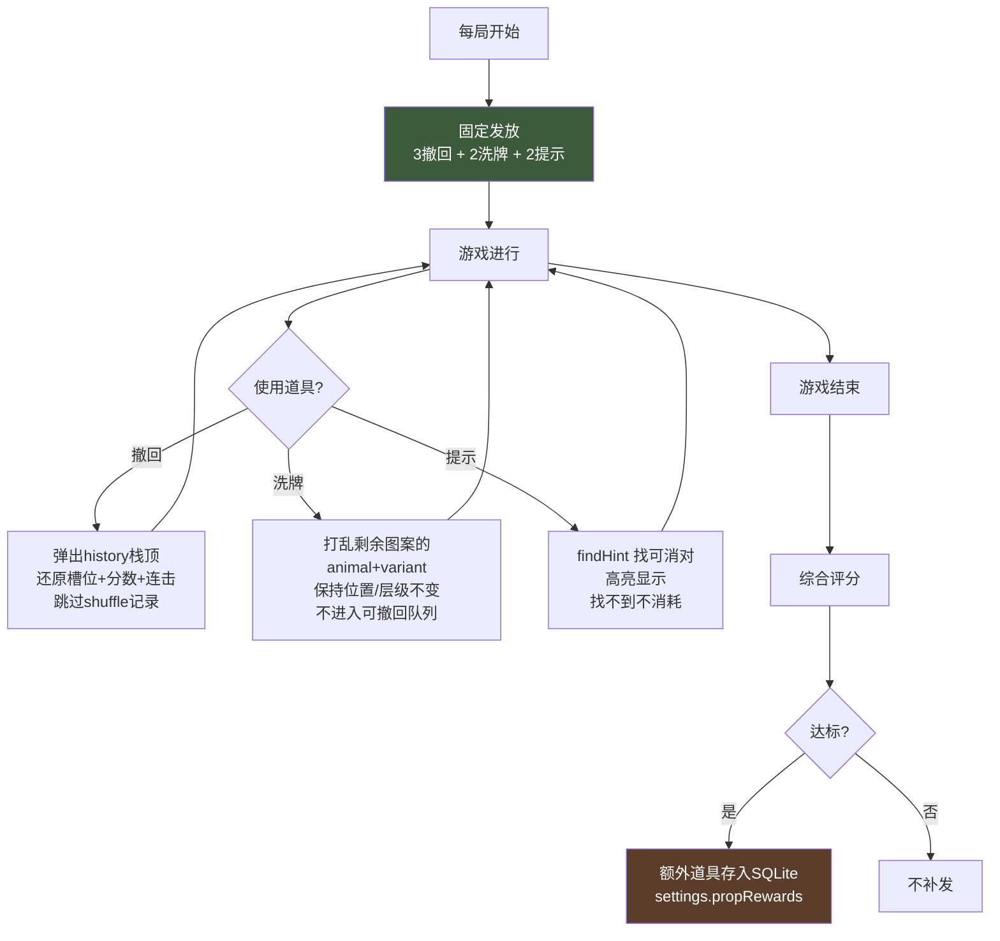
```mermaid
flowchart TD
    A["每局开始"] --> B["固定发放<br/>3撤回 + 2洗牌 + 2提示"]
    B --> C["游戏进行"]
    C --> D{"使用道具?"}
    D -->|撤回| E["弹出history栈顶<br/>还原槽位+分数+连击<br/>跳过shuffle记录"]
    D -->|洗牌| F["打乱剩余图案的animal+variant<br/>保持位置/层级不变<br/>不进入可撤回队列"]
    D -->|提示| G["findHint 找可消对<br/>高亮显示<br/>找不到不消耗"]
    E --> C
    F --> C
    G --> C
    C --> H["游戏结束"]
    H --> I["综合评分"]
    I --> J{"达标?"}
    J -->|是| K["额外道具存入SQLite<br/>settings.propRewards"]
    J -->|否| L["不补发"]

    style B fill:#3d5a3d,color:#ffffff
    style K fill:#5a3d2b,color:#ffffff
```

### 撤回算法

撤回支持细粒度回滚，pick 和 match 各记一条 history：

1. 从 history 末尾往前找第一条 `pick` 或 `match`（跳过 `shuffle`）
2. 若是 `pick`：还原槽位快照，恢复分数/连击
3. 若是 `match`：取消消除（`removed=false`），还原槽位快照，恢复分数/连击
4. 删除该 history 条目，消耗1个撤回道具

---

## 八、渲染层组件架构

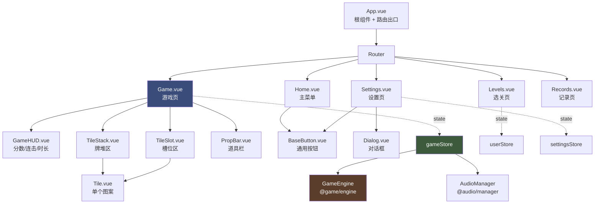
```mermaid
flowchart TD
    App["App.vue<br/>根组件 + 路由出口"] --> Router
    Router --> Home["Home.vue<br/>主菜单"]
    Router --> Game["Game.vue<br/>游戏页"]
    Router --> Levels["Levels.vue<br/>选关页"]
    Router --> Settings["Settings.vue<br/>设置页"]
    Router --> Records["Records.vue<br/>记录页"]

    Game --> HUD["GameHUD.vue<br/>分数/连击/时长"]
    Game --> Stack["TileStack.vue<br/>牌堆区"]
    Game --> Slot["TileSlot.vue<br/>槽位区"]
    Game --> Prop["PropBar.vue<br/>道具栏"]

    Stack --> Tile["Tile.vue<br/>单个图案"]
    Slot --> Tile

    Home --> Btn["BaseButton.vue<br/>通用按钮"]
    Settings --> Btn
    Settings --> Dlg["Dialog.vue<br/>对话框"]

    Game -.->|state| StoreGame["gameStore"]
    Levels -.->|state| StoreUser["userStore"]
    Settings -.->|state| StoreSet["settingsStore"]

    StoreGame --> Engine["GameEngine<br/>@game/engine"]
    StoreGame --> Audio["AudioManager<br/>@audio/manager"]

    style Game fill:#3a4d7a,color:#ffffff
    style Engine fill:#5a3d2b,color:#ffffff
    style StoreGame fill:#3d5a3d,color:#ffffff
```

---

## 九、IPC 通信设计

### 通道清单

| 模块 | 通道 | 方向 | 说明 |
|---|---|---|---|
| 分数 | `score:save` | Renderer→Main | 保存单局记录 |
| | `score:getRecords` | Renderer→Main | 查询记录列表 |
| | `score:getBest` | Renderer→Main | 查指定模式最高分 |
| | `score:getRanking` | Renderer→Main | 全局排行榜 |
| 进度 | `progress:getAll` | Renderer→Main | 全部关卡进度 |
| | `progress:get` | Renderer→Main | 单关进度 |
| | `progress:update` | Renderer→Main | 更新进度 |
| | `progress:unlock` | Renderer→Main | 解锁关卡 |
| 成就 | `achievement:getAll` | Renderer→Main | 全部成就 |
| | `achievement:unlock` | Renderer→Main | 解锁成就 |
| | `achievement:updateProgress` | Renderer→Main | 更新进度 |
| 设置 | `settings:getAll` | Renderer→Main | 全部设置 |
| | `settings:get` | Renderer→Main | 单个设置 |
| | `settings:set` | Renderer→Main | 写入设置 |
| | `settings:reset` | Renderer→Main | 重置设置 |
| | `settings:clearAllData` | Renderer→Main | 清空所有数据 |
| 资源 | `asset:resolve` | Renderer→Main | 解析资源路径 |
| | `asset:getDataPath` | Renderer→Main | 获取数据目录 |

---

## 十、解压即玩打包方案

### 10.1 打包流程

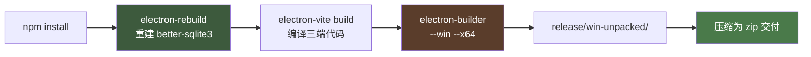
```mermaid
flowchart LR
    A["npm install"] --> B["electron-rebuild<br/>重建 better-sqlite3"]
    B --> C["electron-vite build<br/>编译三端代码"]
    C --> D["electron-builder<br/>--win --x64"]
    D --> E["release/win-unpacked/"]
    E --> F["压缩为 zip 交付"]

    style B fill:#3d5a3d,color:#ffffff
    style D fill:#5a3d2b,color:#ffffff
    style F fill:#4a7a4a,color:#ffffff
```

### 10.2 关键配置

```json
{
  "target": [{ "target": "dir", "arch": ["x64"] }],
  "extraResources": [
    {
      "from": "node_modules/better-sqlite3/build/Release/better_sqlite3.node",
      "to": "native/better_sqlite3.node"
    }
  ],
  "win": {
    "signAndEditExecutable": false
  }
}
```

- `target: dir` → 输出文件夹而非安装包
- `extraResources` → 原生模块单独抽出，避免 asar 压原生模块出问题
- `signAndEditExecutable: false` → 跳过代码签名（解压版无需签名，且避免 Windows 符号链接权限问题）

### 10.3 nativeBinding 加载逻辑

```typescript
// 打包后：resources/native/better_sqlite3.node
if (app.isPackaged) {
  options.nativeBinding = path.join(process.resourcesPath, 'native', 'better_sqlite3.node')
}
// 开发环境：不传，走默认查找
db = new Database(dbPath, options)
```

### 10.4 零依赖保证

| 依赖项 | 来源 | 说明 |
|---|---|---|
| Node.js 运行时 | Electron 内置 | 不需系统安装 |
| Chromium 浏览器 | Electron 内置 | 不需系统安装 |
| SQLite 原生模块 | 随包附带 | `resources/native/` |
| 字体 | 系统默认 | PingFang/YaHei |
| 图片素材 | Emoji | 无需图片文件 |
| 音频文件 | 可选 | 缺失时 Web Audio API 程序化生成回退 |
| 配置文件 | 首次启动生成 | `%APPDATA%/BeastGame/` |
| 环境变量 | 无 | 完全不依赖 |

---

## 十一、关键设计决策

### 11.1 游戏引擎与 UI 解耦

**决策**：游戏引擎位于 `src/game/`，纯 TypeScript，不 import vue/electron。

**原因**：
- 引擎可独立单元测试
- UI 重构不影响游戏逻辑
- 未来可移植到其他框架（React/原生）

### 11.2 不可变状态更新

**决策**：`GameEngine` 所有方法返回新的 `GameState`，不修改原 state。

**原因**：
- Vue 响应式系统需要新对象引用才能触发更新
- 撤回功能依赖历史快照，不可变更容易实现
- 避免 side effect 导致的难以追踪的 bug

**实现**：`cloneState` 用 JSON 深拷贝 + 重新链接 `slot.tile` 引用。

### 11.3 coveredBy 生成后不变

**决策**：`tile.coveredBy` 在 `generateTiles` 中计算后不再更新。

**原因**：
- 覆盖关系是静态的（位置不变）
- 消除时只标记 `removed=true`，不删除 tile
- `canPick` 通过检查覆盖者 `removed` 来判断当前是否被覆盖

### 11.4 设置 key 用驼峰

**决策**：SQLite settings 表的 key 用驼峰命名（`bgmVolume` 而非 `bgm_volume`）。

**原因**：
- 渲染层 Pinia store 直接用驼峰
- 避免 DB↔Store 之间的命名转换
- JS 生态习惯用驼峰

### 11.5 音频程序化生成回退

**决策**：`AudioManager` 优先用 Howler.js 加载音频文件，加载失败时回退到 `ToneGenerator`（Web Audio API 程序化合成），不抛异常。

**原因**：
- "解压即玩"要求不依赖外部音频文件
- `ToneGenerator` 用 OscillatorNode + GainNode + BiquadFilter 实时合成所有音效
- 12种动物按真实特征模拟（频率+波形+包络+颤音+噪声）
- 3种 BGM 循环（home/game/level）按和弦进行程序生成
- 玩家可后续自行添加音频文件到 `resources/audio/` 覆盖程序化音效

---

## 十二、开发任务完成状态

| # | 任务 | 状态 |
|---|---|---|
| 1 | 项目骨架（electron-vite + Vue3 + TS） | ✅ |
| 2 | 打包配置（解压版文件夹） | ✅ |
| 3 | SQLite 数据层 + IPC + Preload | ✅ |
| 4 | 游戏引擎核心（types/engine/matcher/generator） | ✅ |
| 5 | 30关 + 6章节 + Boss配置 | ✅ |
| 6 | Pinia Stores（game/settings/user） | ✅ |
| 7 | 路由 + 主菜单 | ✅ |
| 8 | 游戏页 + 5个游戏组件 | ✅ |
| 9 | 道具系统（撤回/洗牌/提示） | ✅ |
| 10 | 计分+连击+综合评分奖励 | ✅ |
| 11 | 选关页 + 闯关解锁逻辑 | ✅ |
| 12 | 成就系统（14个成就） | ✅ |
| 13 | 音效系统（Howler.js） | ✅ |
| 14 | 设置页（音量/说明/记录/重置） | ✅ |
| 15 | 记录页（排行榜+成就） | ✅ |
| 16 | 资源目录 + 说明文件 | ✅ |
| 17 | 全项目复盘 + bug修复 | ✅ |
| 18 | README + ARCHITECTURE 文档 | ✅ |

---

## 十三、v2 改动：像素风动物 + 多区域布局（2026-07-22）

### 13.1 改动总览

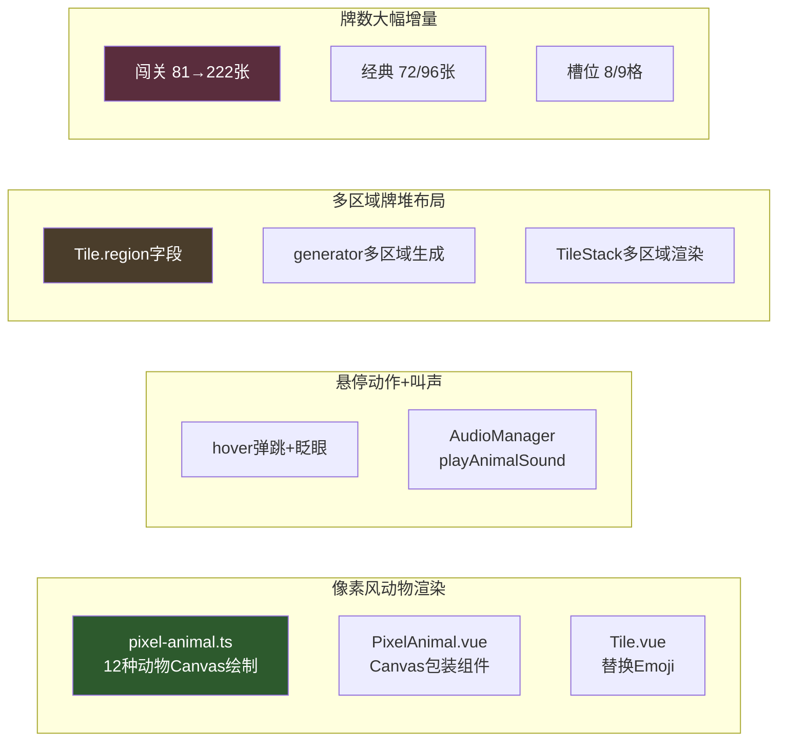
```mermaid
flowchart LR
    subgraph 像素动物["像素风动物渲染"]
        PA1["pixel-animal.ts<br/>12种动物Canvas绘制"]
        PA2["PixelAnimal.vue<br/>Canvas包装组件"]
        PA3["Tile.vue<br/>替换Emoji"]
    end

    subgraph 悬停互动["悬停动作+叫声"]
        HO1["hover弹跳+眨眼"]
        HO2["AudioManager<br/>playAnimalSound"]
    end

    subgraph 多区域["多区域牌堆布局"]
        MR1["Tile.region字段"]
        MR2["generator多区域生成"]
        MR3["TileStack多区域渲染"]
    end

    subgraph 牌数增量["牌数大幅增量"]
        TI1["闯关 81→222张"]
        TI2["经典 72/96张"]
        TI3["槽位 8/9格"]
    end

    style PA1 fill:#2d5a2d,color:#fff
    style MR1 fill:#4a3d2b,color:#fff
    style TI1 fill:#5a2d3d,color:#fff
```

### 13.2 像素风动物渲染系统

**新增文件**：
- `src/renderer/src/utils/pixel-animal.ts` - 12种动物的 Canvas 像素绘制函数
- `src/renderer/src/components/game/PixelAnimal.vue` - Canvas 包装组件

**渲染原理**：

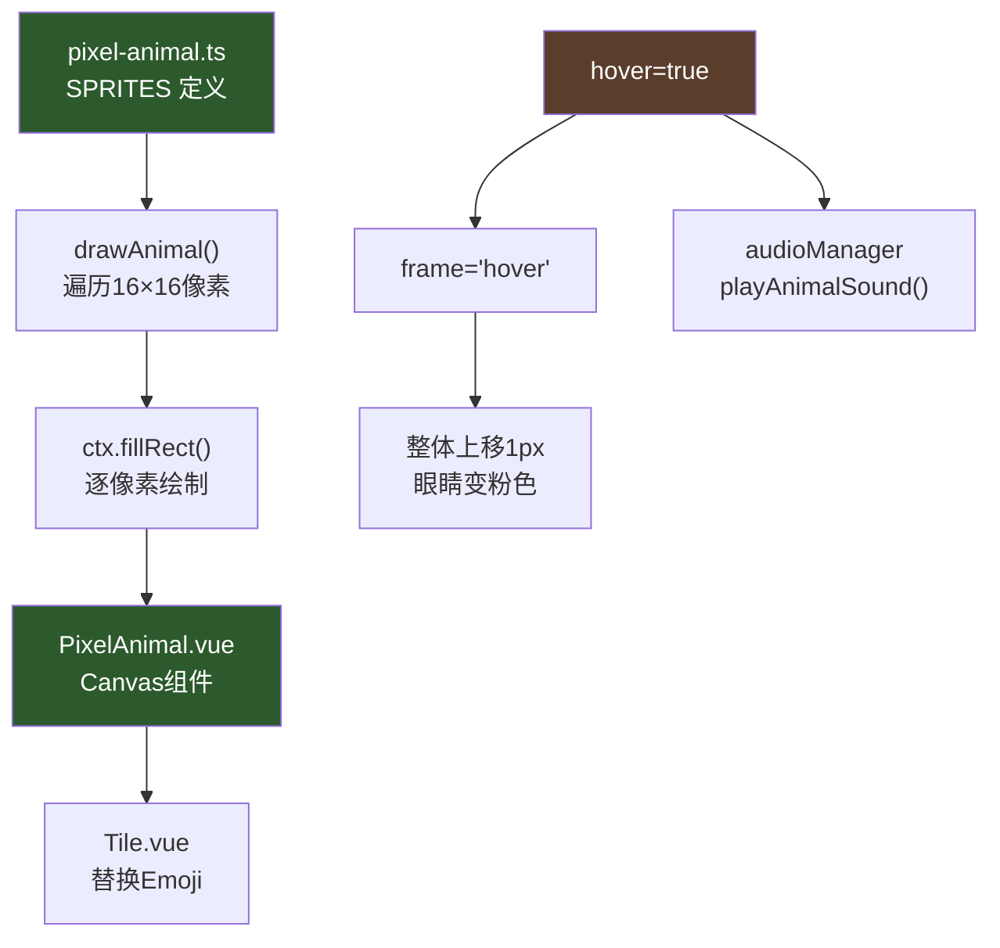
```mermaid
flowchart TB
    A["pixel-animal.ts<br/>SPRITES 定义"] --> B["drawAnimal()<br/>遍历16×16像素"]
    B --> C["ctx.fillRect()<br/>逐像素绘制"]
    C --> D["PixelAnimal.vue<br/>Canvas组件"]
    D --> E["Tile.vue<br/>替换Emoji"]

    F["hover=true"] --> G["frame='hover'"]
    G --> H["整体上移1px<br/>眼睛变粉色"]
    F --> I["audioManager<br/>playAnimalSound()"]

    style A fill:#2d5a2d,color:#fff
    style D fill:#2d5a2d,color:#fff
    style F fill:#5a3d2b,color:#fff
```

**像素图设计**：
- 16×16 像素网格
- 调色板系统：`K`黑/`W`白/`M`主色/`S`次色/`L`亮色/`P`粉/`E`眼/`B`嘴/`O`描边
- 每种动物定义 palette + pixels 数组
- variant 1 叠加小帽子

### 13.3 多区域牌堆布局

**布局结构**（5区域 CSS Grid）：

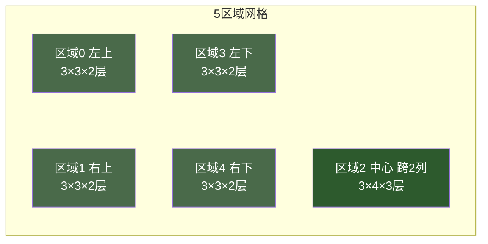
```mermaid
flowchart TB
    subgraph 多区域布局["5区域网格"]
        direction TB
        A["区域0 左上<br/>3×3×2层"]
        B["区域1 右上<br/>3×3×2层"]
        C["区域2 中心 跨2列<br/>3×4×3层"]
        D["区域3 左下<br/>3×3×2层"]
        E["区域4 右下<br/>3×3×2层"]
        A ~~~ B
        C
        D ~~~ E
    end

    style C fill:#2d5a2d,color:#fff
    style A fill:#4a6a4a,color:#fff
    style B fill:#4a6a4a,color:#fff
    style D fill:#4a6a4a,color:#fff
    style E fill:#4a6a4a,color:#fff
```

**数据流**：


```mermaid
flowchart LR
    A["LevelConfig.regions<br/>RegionConfig[]"] --> B["generator.ts<br/>distributeTilesToRegions()"]
    B --> C["每个区域<br/>独立generateRegionTiles()"]
    C --> D["Tile.region<br/>标识所属区域"]
    D --> E["TileStack.vue<br/>regionGroups分组"]
    E --> F["CSS Grid<br/>按区域排列"]

    style A fill:#4a3d2b,color:#fff
    style D fill:#4a3d2b,color:#fff
    style F fill:#2d5a2d,color:#fff
```

**覆盖关系**：coveredBy 仅在同区域内计算，不同区域之间不互相覆盖。

### 13.4 牌数与槽位变化

| 项目 | v1 | v2 |
|---|---|---|
| 闯关牌数范围 | 18→60 | 81→222 |
| 经典3消牌数 | 36 | 72 |
| 经典4消牌数 | 48 | 96 |
| 闯关槽位数 | 7 | 8 |
| 经典3消槽位 | 7 | 8 |
| 经典4消槽位 | 8 | 9 |
| 区域数 | 1 | 5 |

### 13.5 悬停互动系统

**交互流程**：

1. 鼠标进入 Tile → `handleMouseEnter()`
2. 设置 `isHover = true` → PixelAnimal 切换到 hover 帧（弹跳+眨眼）
3. 调用 `audioManager.playAnimalSound(animal)` → 播放对应动物叫声
4. 鼠标离开 → `isHover = false` → 恢复 idle 帧

**音效**：12种动物特征叫声，由 `ToneGenerator` 程序化生成（频率+波形+包络+颤音+噪声），无音频文件依赖。

### 13.6 向后兼容设计

- `LevelConfig.regions` 为可选字段，不填时走旧的单区域生成逻辑
- `TileStack.vue` 检测 `regionGroups.length`，单区域时走旧渲染路径
- `generator.ts` 双路径：有 regions 走多区域，无 regions 走旧逻辑

---

## 十四、v3 改动：24×24 像素图 + 全屏单大堆（2026-07-22）

### 14.1 改动总览

针对 v2 体验反馈的两个问题：
1. **动物特征不明显**：16×16 像素图太小，身体形状几乎一样
2. **画面依旧空**：5 区域之间有大间隙，每区域牌数少

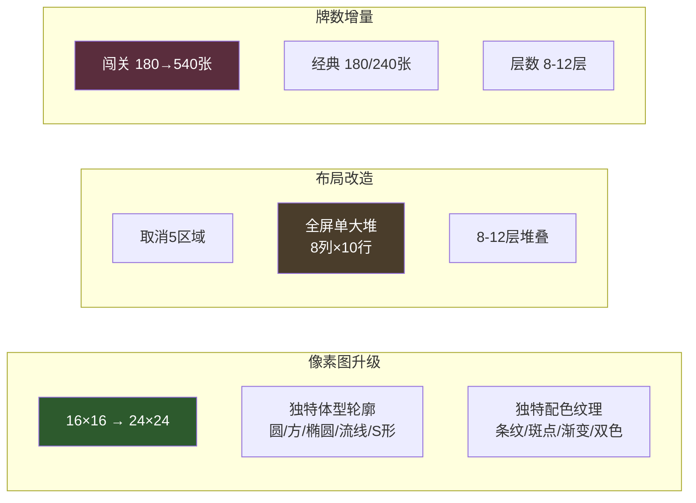
```mermaid
flowchart LR
    subgraph 像素升级["像素图升级"]
        P1["16×16 → 24×24"]
        P2["独特体型轮廓<br/>圆/方/椭圆/流线/S形"]
        P3["独特配色纹理<br/>条纹/斑点/渐变/双色"]
    end

    subgraph 布局改造["布局改造"]
        L1["取消5区域"]
        L2["全屏单大堆<br/>8列×10行"]
        L3["8-12层堆叠"]
    end

    subgraph 牌数增量["牌数增量"]
        T1["闯关 180→540张"]
        T2["经典 180/240张"]
        T3["层数 8-12层"]
    end

    style P1 fill:#2d5a2d,color:#fff
    style L2 fill:#4a3d2b,color:#fff
    style T1 fill:#5a2d3d,color:#fff
```

### 14.2 24×24 像素图设计

**12 种动物独特特征**：

| 动物 | 体型轮廓 | 配色纹理 | 辨识点 |
|---|---|---|---|
| 绵羊 | 圆形蓬松 | 白色卷毛纹理点 | 黑脸 + 卷毛 |
| 小鸡 | 圆胖 | 黄色 + 橙尖嘴 | 三角冠 |
| 小猫 | 椭圆+长尾 | 橙色条纹 | 竖三角耳 |
| 小狗 | 方形 | 棕色 + 红项圈 | 垂耳 |
| 兔子 | 高个 | 白色 | 超长耳 |
| 仓鼠 | 短胖 | 橙白双色 | 大颊囊 |
| 老虎 | 椭圆 | 橙色黑条纹 | 凶眉 |
| 小熊 | 圆肚 | 棕色 + 米色胸 | 圆耳 |
| 小鱼 | 流线型 | 蓝色鳞片 | 三角尾鳍 |
| 鲸鱼 | 大椭圆 | 蓝紫 + 白肚 | 喷水 |
| 小鸭 | 椭圆 | 黄色 + 扁嘴 | 翅膀 |
| 白鹅 | S形长脖 | 白色 | 长脖 |

### 14.3 全屏单大堆布局

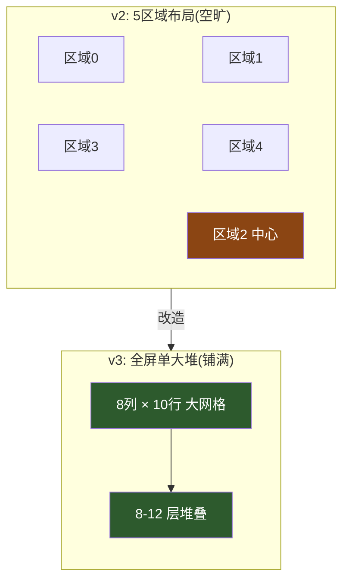
```mermaid
flowchart TB
    subgraph v2["v2: 5区域布局(空旷)"]
        direction LR
        A2["区域0"] ~~~ B2["区域1"]
        C2["区域2 中心"]
        D2["区域3"] ~~~ E2["区域4"]
    end

    subgraph v3["v3: 全屏单大堆(铺满)"]
        direction TB
        F["8列 × 10行 大网格"]
        G["8-12 层堆叠"]
        F --> G
    end

    v2 -->|改造| v3

    style C2 fill:#8b4513,color:#fff
    style F fill:#2d5a2d,color:#fff
    style G fill:#2d5a2d,color:#fff
```

**布局参数**：
- 网格：8 列 × 10 行 = 80 格
- 层数：8-12 层
- 牌数：180-540 张
- 牌面尺寸：64×68 px
- 层偏移：10px（每层向右下偏移）

### 14.4 牌数与层级变化

| 项目 | v2 | v3 |
|---|---|---|
| 闯关牌数范围 | 81→222 | 180→540 |
| 经典3消牌数 | 72 | 180 |
| 经典4消牌数 | 96 | 240 |
| 层数范围 | 3→5 | 8→12 |
| 布局方式 | 5区域 | 全屏单大堆 |
| 网格大小 | 3×3 / 3×4 | 8×10 |
| 像素图分辨率 | 16×16 | 24×24 |
| 牌面尺寸 | 48×52 px | 64×68 px |

### 14.5 改动文件清单

| 文件 | 改动 |
|---|---|
| `pixel-animal.ts` | 重写为 24×24 像素图，12种动物独特体型+纹理 |
| `PixelAnimal.vue` | 适配 24×24 尺寸，默认 size=56 |
| `Tile.vue` | 牌面 48×52→64×68，动物 36→52 |
| `generator.ts` | 改回单区域大网格生成器 |
| `levels.config.ts` | 牌数 180→540，层数 8→12，网格 8×10 |
| `engine.ts` | 经典模式 180/240 张 8 层 |
| `TileStack.vue` | 改回单区域渲染，支持大网格+滚动 |

---

## 十五、v4 改动：连击反馈系统 + 夸赞弹幕（2026-07-22）

### 15.1 改动总览

针对连击体验反馈，新增完整的"连击反馈系统"：
1. **连击数字分级变色**：根据 combo 数目分 7 档颜色 + 动画
2. **夸赞弹幕**：达到阈值时弹出 GOOD/NICE/GREAT/AMAZING/UNBELIEVABLE/GOD LIKE
3. **配合音效**：每个等级有对应音效文件

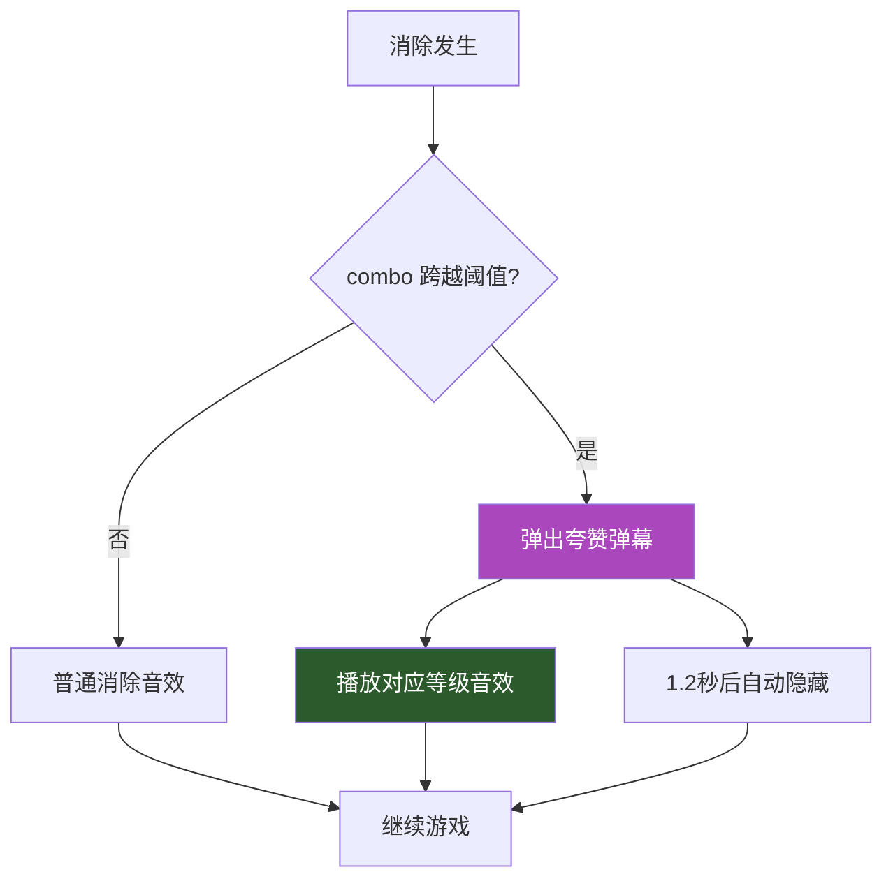
```mermaid
flowchart TB
    A[消除发生] --> B{combo 跨越阈值?}
    B -->|是| C[弹出夸赞弹幕]
    B -->|否| D[普通消除音效]
    C --> E[播放对应等级音效]
    C --> F[1.2秒后自动隐藏]
    D --> G[继续游戏]
    E --> G
    F --> G

    style C fill:#ab47bc,color:#fff
    style E fill:#2d5a2d,color:#fff
```

### 15.2 连击分级配色

```mermaid
flowchart LR
    subgraph 连击分级["7档连击配色"]
        L1["0-2 默认色<br/>18px"]
        L2["3-4 黄色<br/>20px + 阴影"]
        L3["5-6 橙色<br/>22px + 阴影"]
        L4["7-9 红色<br/>24px + 阴影"]
        L5["10-14 紫色<br/>26px + 阴影"]
        L6["15-19 金色<br/>28px + 发光动画"]
        L7["20+ 彩虹<br/>30px + 流光动画"]
    end

    style L6 fill:#ffd700,color:#000
    style L7 fill:#8b0000,color:#fff
```

### 15.3 夸赞阈值与文案

| combo 阈值 | 等级 tier | 夸赞文案 | 字号 | 配色 | 音效文件 |
|---|---|---|---|---|---|
| 3 | good | GOOD! | 48px | 黄 #ffd54f | sfx_combo_good.mp3 |
| 5 | nice | NICE! | 48px | 橙 #ffa726 | sfx_combo_nice.mp3 |
| 7 | great | GREAT! | 48px | 红橙 #ff7043 | sfx_combo_great.mp3 |
| 10 | amazing | AMAZING! | 56px | 紫 #ab47bc | sfx_combo_amazing.mp3 |
| 15 | unbelievable | UNBELIEVABLE! | 60px | 金 #ffd700 + 发光 | sfx_combo_unbelievable.mp3 |
| 20 | godlike | GOD LIKE! | 64px | 彩虹渐变 | sfx_combo_godlike.mp3 |

### 15.4 触发逻辑

**关键算法**：`getComboTierCrossed(prevCombo, curCombo)` 检测"首次跨越阈值"。

- combo 从 0→1：不弹幕
- combo 从 2→3：弹 GOOD!（首次达到 good 阈值）
- combo 从 3→4：不弹（仍在 good 等级内）
- combo 从 4→5：弹 NICE!（首次达到 nice 阈值）
- combo 从 5→6：不弹
- ...以此类推

**触发位置**：`game.ts` store 的 `pickTile` 方法中，在调用引擎 `pickTile` 后检测 `prevCombo → curCombo` 是否跨越阈值。

### 15.5 改动文件清单

| 文件 | 改动 |
|---|---|
| `audio/manager.ts` | 新增 ComboTier 类型、6个阈值常量、getComboTier/getComboTierCrossed 函数、playComboPraise 方法 |
| `components/game/ComboPraise.vue` | **新增** 夸赞弹幕组件，6档配色+动画 |
| `components/game/GameHUD.vue` | 连击数字分7档配色 + 字号递增 + 发光/彩虹动画 |
| `stores/game.ts` | 新增 comboPraise 响应式状态、hideComboPraise 方法、pickTile 中跨阈值检测 |
| `views/Game.vue` | 挂载 ComboPraise 组件 |
| `resources/README.md` | 新增 6 个连击夸赞音效文件说明 |

---

## 十六、v5 改动：真实音频文件 + 程序化回退（2026-07-22）

### 16.1 改动总览

针对"BGM难听 + 动物音效不像 + 主菜单无BGM无按钮音效"问题，从 Mixkit 下载真实音频文件，Howler 优先播放文件，缺失时回退到 ToneGenerator 程序化合成：

```mermaid
flowchart TB
    subgraph 问题["v4 存在问题"]
        P1["主菜单无BGM"]
        P2["按钮无hover音效"]
        P3["动物音效无特征"]
        P4["打包后无声音<br/>音频文件缺失"]
    end

    subgraph 方案["v5 解决方案"]
        S1["Mixkit 真实音频文件<br/>29个mp3随包打包"]
        S2["3种BGM<br/>Fun and Games / A Game / Sci-Fi Game"]
        S3["按钮hover/click音效"]
        S4["12种动物真实叫声"]
        S5["Howler优先播放文件<br/>file:// URL 加载"]
        S6["ToneGenerator 回退<br/>文件缺失时程序合成"]
    end

    P1 --> S2
    P2 --> S3
    P3 --> S4
    P4 --> S5
    S2 --> S1
    S3 --> S1
    S4 --> S1
    S5 -->|加载失败| S6

    style P4 fill:#8b0000,color:#fff
    style S1 fill:#2d5a2d,color:#fff
    style S4 fill:#5a3d2b,color:#fff
    style S6 fill:#5a3d2b,color:#fff
```

### 16.2 音频架构

```mermaid
flowchart LR
    subgraph 调用层["调用方"]
        UI["UI组件<br/>Home/Game/Tile/BaseButton"]
    end

    subgraph 管理层["AudioManager 单例"]
        AM["playBgm<br/>playSfx<br/>playAnimalSound<br/>playComboPraise<br/>playHover"]
    end

    subgraph 文件层["Howler.js 文件播放"]
        HL["loadHowl<br/>优先加载mp3文件"]
    end

    subgraph 程序层["ToneGenerator 程序生成"]
        TG["OscillatorNode<br/>GainNode<br/>BiquadFilter"]
    end

    UI --> AM
    AM -->|优先| HL
    HL -->|加载成功| PLAY1["播放文件"]
    HL -->|加载失败/超时| TG
    TG --> PLAY2["程序合成播放"]

    style AM fill:#3d5a3d,color:#fff
    style TG fill:#5a3d2b,color:#fff
    style HL fill:#4a3d7a,color:#fff
```

### 16.3 12种动物音效来源

从 Mixkit 下载真实动物录音，部分动物无专门录音使用相近音效替代：

| 动物 | Mixkit 音效名 | 真实/替代 | 时长 |
|---|---|---|---|
| 绵羊 | Cow moo | 替代（农场动物） | 0:02 |
| 小鸡 | Rooster crowing | 真实（鸡类） | 0:04 |
| 小猫 | Sweet kitty meow | 真实 | 0:01 |
| 小狗 | Dog barking twice | 真实 | 0:01 |
| 兔子 | Little bird calling chirp | 替代（小动物） | 0:01 |
| 仓鼠 | Crickets and insects | 替代（吱吱声） | - |
| 老虎 | Wild lion animal roar | 替代（大型猫科） | 0:01 |
| 小熊 | Aggressive beast roar | 替代（野兽吼叫） | 0:01 |
| 小鱼 | Water flowing | 替代（水声） | - |
| 鲸鱼 | Ocean ambience | 替代（海洋） | - |
| 小鸭 | Duck quack | 真实 | - |
| 白鹅 | Flock of wild geese | 真实 | 0:05 |

### 16.4 BGM 真实音乐文件

3种 BGM 从 Mixkit Free Stock Music 下载，Howler 设置 `loop: true` 循环播放：

| BGM | 曲名 | 作者 | 风格标签 | 时长 |
|---|---|---|---|---|
| home（主菜单） | Fun and Games | Ahjay Stelino | Humorous, Quirky, Fairytale, Flute | 2:19 |
| game（游戏中） | A Game | Michael Ramir C. | Propulsive, Driving, Electro House | 1:53 |
| level（闯关） | Sci-Fi Game | Arulo | Mysterious, Weird, Synth | 1:40 |

文件缺失时回退到 ToneGenerator 的 `startBgmLoop` 程序化循环（C-G-Am-F 等和弦进行）。

### 16.5 Howler 回退机制

```mermaid
sequenceDiagram
    participant UI as UI组件
    participant AM as AudioManager
    participant HL as Howler.loadHowl
    participant TG as ToneGenerator

    UI->>AM: playAnimalSound('sheep')
    AM->>HL: loadHowl('audio/animal_sheep.mp3')
    alt 文件存在
        HL-->>AM: Howl对象(loaded)
        AM->>HL: howl.play()
    else 文件缺失/加载失败/3秒超时
        HL-->>AM: null
        AM->>TG: playAnimalSound('sheep')
        TG->>TG: OscillatorNode合成
    end
```

**loadHowl 关键改进**：
1. 用 Promise 包裹 Howl 的 `onload`/`onloaderror` 事件，3秒超时兜底，确保文件缺失时正确返回 null 并回退到 ToneGenerator
2. 将本地路径转换为 `file:///` URL（Howler 加载本地文件需要 file 协议）
3. Windows 路径 `D:\...\file.mp3` → `file:///D:/.../file.mp3`

### 16.6 改动文件清单

| 文件 | 改动 |
|---|---|
| `resources/audio/*.mp3` | **新增** 29个真实音频文件（12动物+3BGM+14SFX），来源 Mixkit |
| `audio/manager.ts` | loadHowl 添加 file:// URL 转换，确保 Howler 正确加载本地文件 |
| `audio/tone-generator.ts` | 保留作为文件缺失时的程序化回退 |
| `resources/README.md` | 更新音频来源与许可说明，添加替代音效说明 |
