# 🏗️ 兽了个兽 - 架构文档

> 本文档描述「兽了个兽」项目的系统架构、数据流、核心模块设计与关键决策。

---

## 一、系统架构总览

项目采用 Electron 三进程架构（主进程 / Preload 桥 / 渲染进程），游戏逻辑与 UI 解耦。

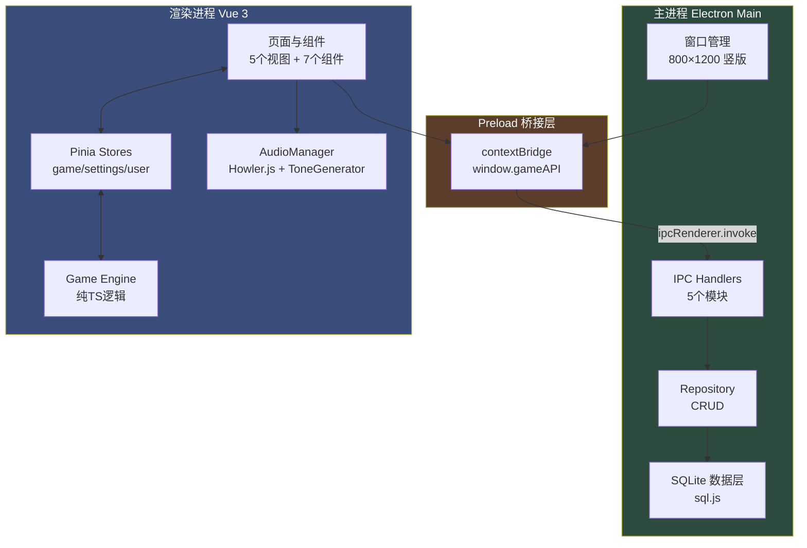
```mermaid
flowchart TB
    subgraph Main["主进程 Electron Main"]
        WIN["窗口管理<br/>800×1200 竖版"]
        DB["SQLite 数据层<br/>sql.js"]
        IPC["IPC Handlers<br/>5个模块"]
        REPO["Repository<br/>CRUD"]
    end

    subgraph Preload["Preload 桥接层"]
        API["contextBridge<br/>window.gameAPI"]
    end

    subgraph Renderer["渲染进程 Vue 3"]
        UI["页面与组件<br/>5个视图 + 7个组件"]
        STORE["Pinia Stores<br/>game/settings/user"]
        ENGINE["Game Engine<br/>纯TS逻辑"]
        AUDIO["AudioManager<br/>Howler.js + ToneGenerator"]
    end

    WIN --> API
    API -->|ipcRenderer.invoke| IPC
    IPC --> REPO
    REPO --> DB
    UI <--> STORE
    STORE <--> ENGINE
    UI --> AUDIO
    UI --> API

    style Main fill:#2d4a3e,color:#ffffff
    style Preload fill:#5a3d2b,color:#ffffff
    style Renderer fill:#3a4d7a,color:#ffffff
```

### 三层职责

| 层 | 职责 | 技术 |
|---|---|---|
| **主进程** | 窗口管理、数据库读写、文件系统 | Electron + sql.js |
| **Preload** | 安全桥接，暴露受限 API | contextBridge |
| **渲染进程** | UI 渲染、游戏逻辑、状态管理 | Vue 3 + Pinia + 纯TS引擎 |

---

## 二、游戏引擎架构

游戏引擎位于 `src/game/`，是纯 TypeScript 实现，**不依赖 Vue 和 Electron**，可独立测试。

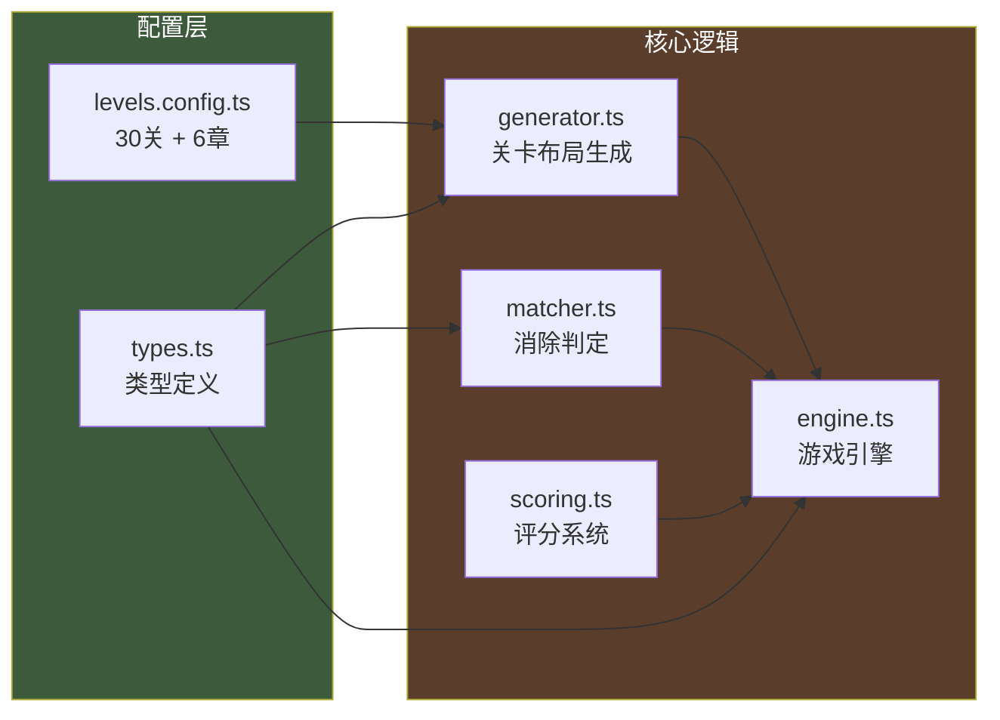
```mermaid
flowchart LR
    subgraph Config["配置层"]
        LV["levels.config.ts<br/>30关 + 6章"]
        TY["types.ts<br/>类型定义"]
    end

    subgraph Core["核心逻辑"]
        GEN["generator.ts<br/>关卡布局生成"]
        MATCH["matcher.ts<br/>消除判定"]
        ENG["engine.ts<br/>游戏引擎"]
        SCORE["scoring.ts<br/>评分系统"]
    end

    LV --> GEN
    TY --> GEN
    TY --> MATCH
    TY --> ENG
    GEN --> ENG
    MATCH --> ENG
    SCORE --> ENG

    style Config fill:#3d5a3d,color:#ffffff
    style Core fill:#5a3d2b,color:#ffffff
```

### 核心数据结构

```typescript
// 游戏运行时状态
interface GameState {
  mode: 'classic3' | 'classic4' | 'level'
  levelId?: number
  config: LevelConfig
  tiles: Tile[]           // 所有图案
  slots: Slot[]           // 底部槽位
  combo: number           // 当前连击
  maxCombo: number        // 最高连击
  score: number           // 当前分数
  props: GameProps        // 道具数量
  propsUsed: GameProps    // 已用道具
  history: HistoryEntry[] // 操作历史（撤回用）
  status: 'playing' | 'won' | 'lost'
  hintTileIds: number[]   // 提示高亮
  lastMatchedTileIds: number[] // 最近消除（动画用）
}

// 单个图案
interface Tile {
  id: number
  animal: AnimalType      // 12种动物之一
  variant: 0 | 1          // 2个变体
  layer: number            // 层级（0=最底）
  x: number; y: number    // 网格坐标
  coveredBy: number[]     // 被哪些tile覆盖
  removed: boolean         // 已消除
  inSlot: boolean          // 在槽位中
}
```

### 引擎方法（全部不可变更新）

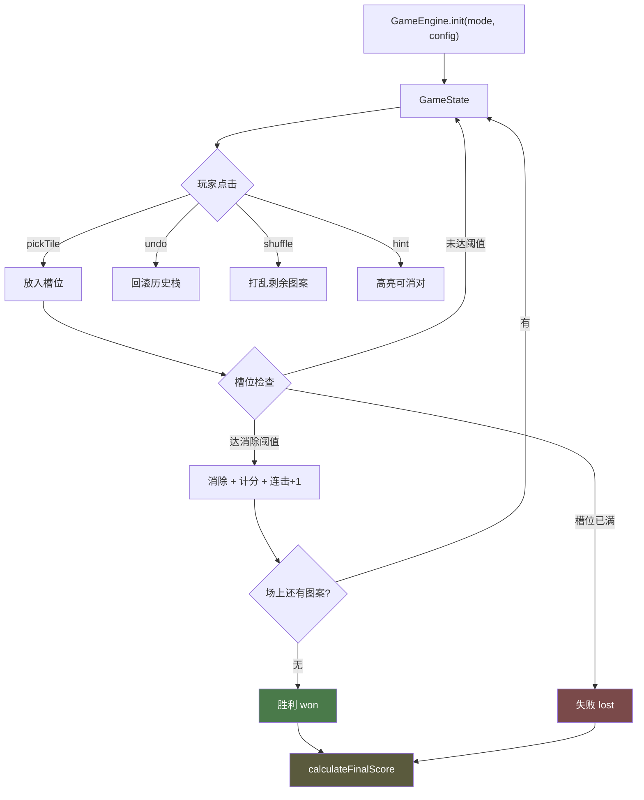
```mermaid
flowchart TD
    A["GameEngine.init(mode, config)"] --> B["GameState"]
    B --> C{"玩家点击"}
    C -->|pickTile| D["放入槽位"]
    D --> E{"槽位检查"}
    E -->|达消除阈值| F["消除 + 计分 + 连击+1"]
    E -->|未达阈值| B
    F --> G{"场上还有图案?"}
    G -->|有| B
    G -->|无| H["胜利 won"]
    E -->|槽位已满| I["失败 lost"]
    C -->|undo| J["回滚历史栈"]
    C -->|shuffle| K["打乱剩余图案"]
    C -->|hint| L["高亮可消对"]
    H --> M["calculateFinalScore"]
    I --> M

    style H fill:#4a7a4a,color:#ffffff
    style I fill:#7a4a4a,color:#ffffff
    style M fill:#5a5a3d,color:#ffffff
```

### 可解性保证算法

`generator.ts` 中的 `buildAnimalVariantList` 保证每个关卡的图案都能被消完：

1. 计算 `totalGroups = tiles / matchCount`
2. 枚举所有 `animal × variant` 组合（每章2种动物 × 2变体 = 4种）
3. 将组数均分到各组合，每组生成 `matchCount` 个相同 tile
4. 总数恰等于 `config.tiles`

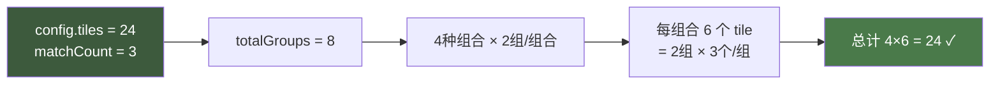
```mermaid
flowchart LR
    A["config.tiles = 24<br/>matchCount = 3"] --> B["totalGroups = 8"]
    B --> C["4种组合 × 2组/组合"]
    C --> D["每组合 6 个 tile<br/>= 2组 × 3个/组"]
    D --> E["总计 4×6 = 24 ✓"]

    style A fill:#3d5a3d,color:#ffffff
    style E fill:#4a7a4a,color:#ffffff
```

---

## 三、数据流架构

### 3.1 渲染层 ↔ 主进程通信

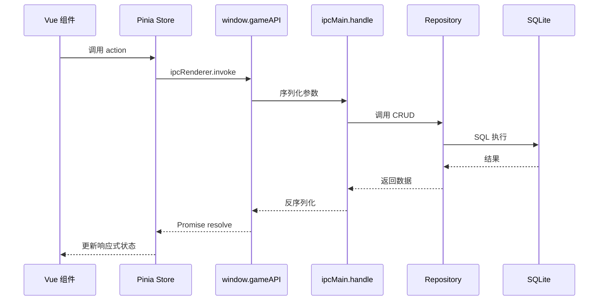
```mermaid
sequenceDiagram
    participant UI as Vue 组件
    participant Store as Pinia Store
    participant API as window.gameAPI
    participant IPC as ipcMain.handle
    participant Repo as Repository
    participant DB as SQLite

    UI->>Store: 调用 action
    Store->>API: ipcRenderer.invoke
    API->>IPC: 序列化参数
    IPC->>Repo: 调用 CRUD
    Repo->>DB: SQL 执行
    DB-->>Repo: 结果
    Repo-->>IPC: 返回数据
    IPC-->>API: 反序列化
    API-->>Store: Promise resolve
    Store-->>UI: 更新响应式状态
```

### 3.2 游戏点击流程

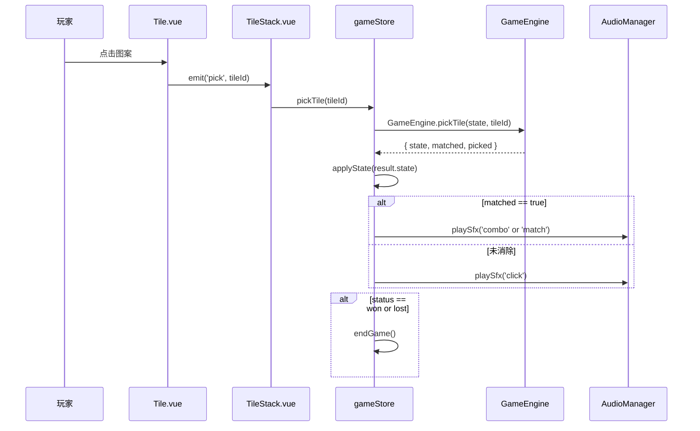
```mermaid
sequenceDiagram
    participant User as 玩家
    participant Tile as Tile.vue
    participant Stack as TileStack.vue
    participant Store as gameStore
    participant Engine as GameEngine
    participant Audio as AudioManager

    User->>Tile: 点击图案
    Tile->>Stack: emit('pick', tileId)
    Stack->>Store: pickTile(tileId)
    Store->>Engine: GameEngine.pickTile(state, tileId)
    Engine-->>Store: { state, matched, picked }
    Store->>Store: applyState(result.state)
    alt matched == true
        Store->>Audio: playSfx('combo' or 'match')
    else 未消除
        Store->>Audio: playSfx('click')
    end
    alt status == won or lost
        Store->>Store: endGame()
    end
```

---

## 四、数据库设计

### 4.1 Schema

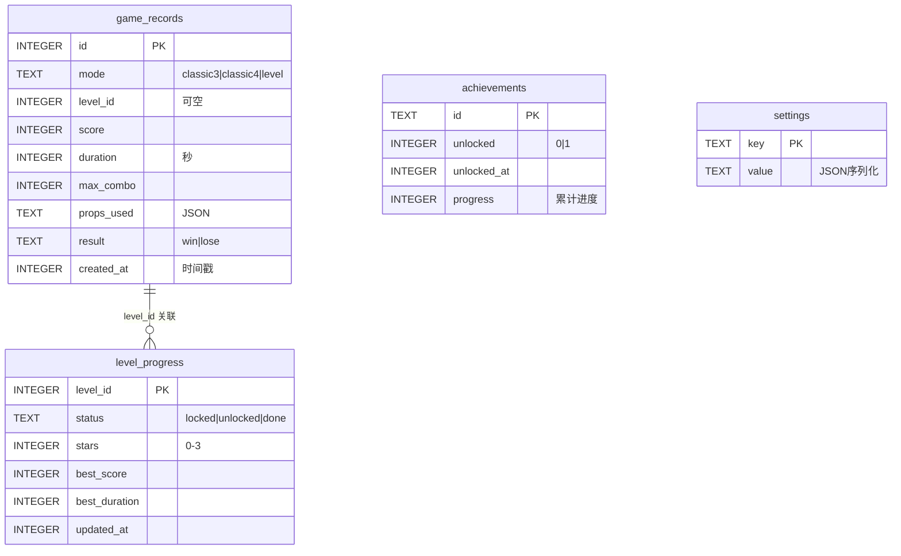
```mermaid
erDiagram
    game_records ||--o{ level_progress : "level_id 关联"
    game_records {
        INTEGER id PK
        TEXT mode "classic3|classic4|level"
        INTEGER level_id "可空"
        INTEGER score
        INTEGER duration "秒"
        INTEGER max_combo
        TEXT props_used "JSON"
        TEXT result "win|lose"
        INTEGER created_at "时间戳"
    }
    level_progress {
        INTEGER level_id PK
        TEXT status "locked|unlocked|done"
        INTEGER stars "0-3"
        INTEGER best_score
        INTEGER best_duration
        INTEGER updated_at
    }
    achievements {
        TEXT id PK
        INTEGER unlocked "0|1"
        INTEGER unlocked_at
        INTEGER progress "累计进度"
    }
    settings {
        TEXT key PK
        TEXT value "JSON序列化"
    }
```

### 4.2 数据库初始化流程

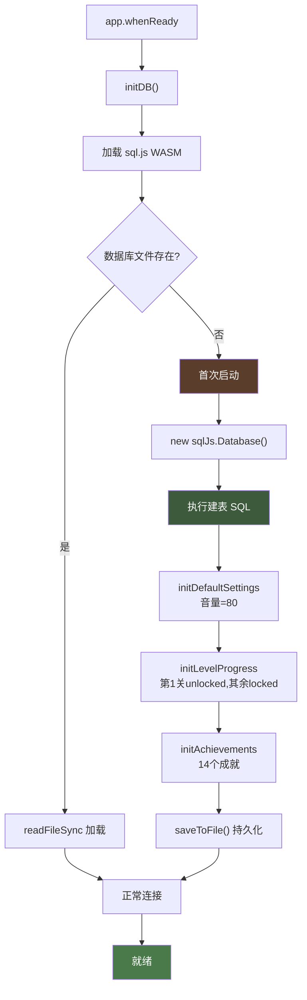
```mermaid
flowchart TD
    A["app.whenReady"] --> B["initDB()"]
    B --> C["加载 sql.js WASM"]
    C --> D{"数据库文件存在?"}
    D -->|否| E["首次启动"]
    E --> F["new sqlJs.Database()"]
    F --> G["执行建表 SQL"]
    G --> H["initDefaultSettings<br/>音量=80"]
    H --> I["initLevelProgress<br/>第1关unlocked,其余locked"]
    I --> J["initAchievements<br/>14个成就"]
    J --> K["saveToFile() 持久化"]
    D -->|是| L["readFileSync 加载"]
    L --> M["正常连接"]
    K --> M
    M --> N["就绪"]

    style E fill:#5a3d2b,color:#ffffff
    style G fill:#3d5a3d,color:#ffffff
    style N fill:#4a7a4a,color:#ffffff
```

### 4.3 首次启动初始化数据

| 表 | 初始化内容 |
|---|---|
| settings | `bgmVolume: 80`, `sfxVolume: 80` |
| level_progress | 30关，第1关 `unlocked`，其余 `locked` |
| achievements | 14个成就，全部 `unlocked: 0` |

---

## 五、30关章节结构（v1.2.0）

前五章统一配置，章节靠动物种类和机制区分；第六章难度增加。

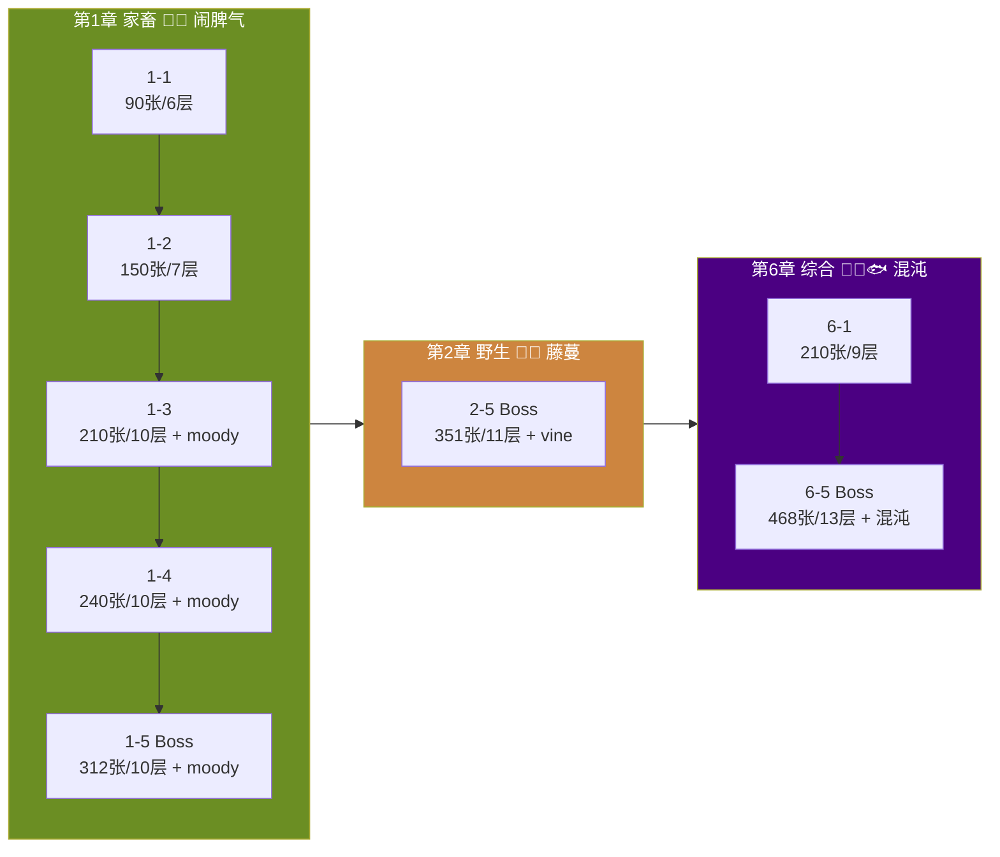
```mermaid
flowchart LR
    subgraph S1["第1章 家畜 🐑🐔 闹脾气"]
        L1["1-1<br/>90张/6层"] --> L2["1-2<br/>150张/7层"]
        L2 --> L3["1-3<br/>210张/10层 + moody"]
        L3 --> L4["1-4<br/>240张/10层 + moody"]
        L4 --> L5["1-5 Boss<br/>312张/10层 + moody"]
    end
    subgraph S2["第2章 野生 🐯🦁 藤蔓"]
        L10["2-5 Boss<br/>351张/11层 + vine"]
    end
    subgraph S6["第6章 综合 🐯🦊🐟 混沌"]
        L26["6-1<br/>210张/9层"] --> L30["6-5 Boss<br/>468张/13层 + 混沌"]
    end
    S1 --> S2 --> S6

    style S1 fill:#6b8e23,color:#ffffff
    style S2 fill:#cd853f,color:#ffffff
    style S6 fill:#4b0082,color:#ffffff
```

### 难度曲线

| 章节 | L1 | L2 | L3 | L4 | Boss | 层数范围 |
|---|---|---|---|---|---|---|
| 1-5章 | 90张/6层 | 150张/7层 | 210张/10层 | 240张/10层 | 312-390张/10-11层 | 6-11 |
| 第6章 | 210张/9层 | 270张/10层 | 330张/12层 | 360张/13层 | 468张/13层 | 9-13 |

Boss 关时间限制：240秒

---

## 六、评分系统

### 6.1 单次消除得分

```
单次得分 = matchCount × 10 + combo × 5
```

- `matchCount`：3消=3，4消=4
- `combo`：连击数（先+1再计分）

### 6.2 综合评分（局终）

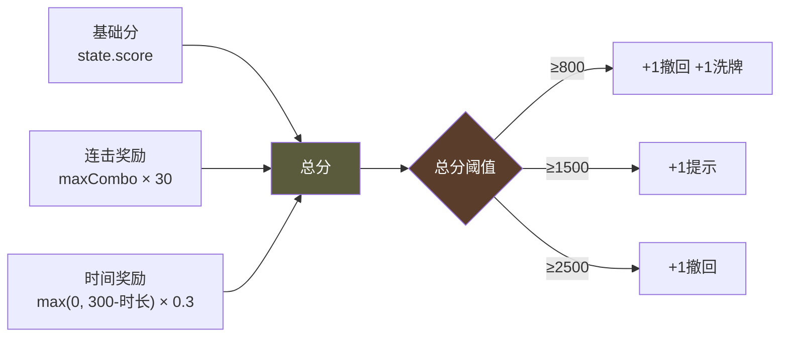
```mermaid
flowchart LR
    A["基础分<br/>state.score"] --> D["总分"]
    B["连击奖励<br/>maxCombo × 30"] --> D
    C["时间奖励<br/>max(0, 300-时长) × 0.3"] --> D
    D --> E{"总分阈值"}
    E -->|≥800| F["+1撤回 +1洗牌"]
    E -->|≥1500| G["+1提示"]
    E -->|≥2500| H["+1撤回"]

    style D fill:#5a5a3d,color:#ffffff
    style E fill:#5a3d2b,color:#ffffff
```

```
总分 = 基础分 × 0.5 + 连击奖励 + 时间奖励
```

---

## 七、道具系统设计

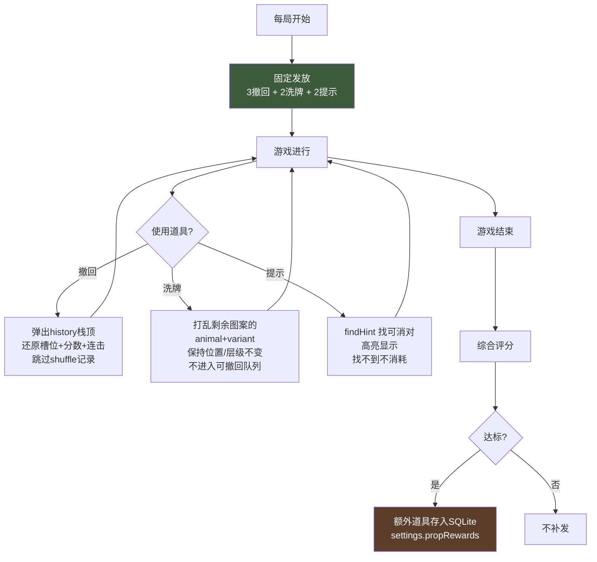
```mermaid
flowchart TD
    A["每局开始"] --> B["固定发放<br/>3撤回 + 2洗牌 + 2提示"]
    B --> C["游戏进行"]
    C --> D{"使用道具?"}
    D -->|撤回| E["弹出history栈顶<br/>还原槽位+分数+连击<br/>跳过shuffle记录"]
    D -->|洗牌| F["打乱剩余图案的animal+variant<br/>保持位置/层级不变<br/>不进入可撤回队列"]
    D -->|提示| G["findHint 找可消对<br/>高亮显示<br/>找不到不消耗"]
    E --> C
    F --> C
    G --> C
    C --> H["游戏结束"]
    H --> I["综合评分"]
    I --> J{"达标?"}
    J -->|是| K["额外道具存入SQLite<br/>settings.propRewards"]
    J -->|否| L["不补发"]

    style B fill:#3d5a3d,color:#ffffff
    style K fill:#5a3d2b,color:#ffffff
```

### 撤回算法

撤回支持细粒度回滚，pick 和 match 各记一条 history：

1. 从 history 末尾往前找第一条 `pick` 或 `match`（跳过 `shuffle`）
2. 若是 `pick`：还原槽位快照，恢复分数/连击
3. 若是 `match`：取消消除（`removed=false`），还原槽位快照，恢复分数/连击
4. 删除该 history 条目，消耗1个撤回道具

---

## 八、渲染层组件架构

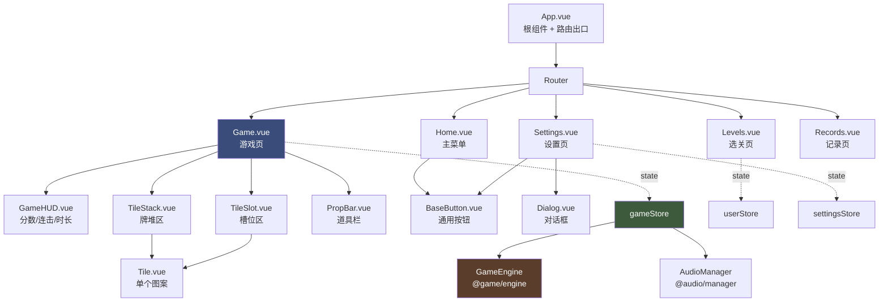
```mermaid
flowchart TD
    App["App.vue<br/>根组件 + 路由出口"] --> Router
    Router --> Home["Home.vue<br/>主菜单"]
    Router --> Game["Game.vue<br/>游戏页"]
    Router --> Levels["Levels.vue<br/>选关页"]
    Router --> Settings["Settings.vue<br/>设置页"]
    Router --> Records["Records.vue<br/>记录页"]

    Game --> HUD["GameHUD.vue<br/>分数/连击/时长"]
    Game --> Stack["TileStack.vue<br/>牌堆区"]
    Game --> Slot["TileSlot.vue<br/>槽位区"]
    Game --> Prop["PropBar.vue<br/>道具栏"]

    Stack --> Tile["Tile.vue<br/>单个图案"]
    Slot --> Tile

    Home --> Btn["BaseButton.vue<br/>通用按钮"]
    Settings --> Btn
    Settings --> Dlg["Dialog.vue<br/>对话框"]

    Game -.->|state| StoreGame["gameStore"]
    Levels -.->|state| StoreUser["userStore"]
    Settings -.->|state| StoreSet["settingsStore"]

    StoreGame --> Engine["GameEngine<br/>@game/engine"]
    StoreGame --> Audio["AudioManager<br/>@audio/manager"]

    style Game fill:#3a4d7a,color:#ffffff
    style Engine fill:#5a3d2b,color:#ffffff
    style StoreGame fill:#3d5a3d,color:#ffffff
```

---

## 九、IPC 通信设计

### 通道清单

| 模块 | 通道 | 方向 | 说明 |
|---|---|---|---|
| 分数 | `score:save` | Renderer→Main | 保存单局记录 |
| | `score:getRecords` | Renderer→Main | 查询记录列表 |
| | `score:getBest` | Renderer→Main | 查指定模式最高分 |
| | `score:getRanking` | Renderer→Main | 全局排行榜 |
| 进度 | `progress:getAll` | Renderer→Main | 全部关卡进度 |
| | `progress:get` | Renderer→Main | 单关进度 |
| | `progress:update` | Renderer→Main | 更新进度 |
| | `progress:unlock` | Renderer→Main | 解锁关卡 |
| 成就 | `achievement:getAll` | Renderer→Main | 全部成就 |
| | `achievement:unlock` | Renderer→Main | 解锁成就 |
| | `achievement:updateProgress` | Renderer→Main | 更新进度 |
| 设置 | `settings:getAll` | Renderer→Main | 全部设置 |
| | `settings:get` | Renderer→Main | 单个设置 |
| | `settings:set` | Renderer→Main | 写入设置 |
| | `settings:reset` | Renderer→Main | 重置设置 |
| | `settings:clearAllData` | Renderer→Main | 清空所有数据 |
| 资源 | `asset:resolve` | Renderer→Main | 解析资源路径 |
| | `asset:getDataPath` | Renderer→Main | 获取数据目录 |

---

## 十、解压即玩打包方案

### 10.1 打包流程

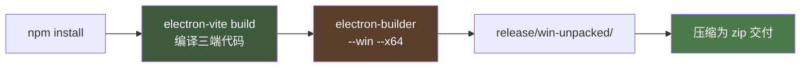
```mermaid
flowchart LR
    A["npm install"] --> B["electron-vite build<br/>编译三端代码"]
    B --> C["electron-builder<br/>--win --x64"]
    C --> D["release/win-unpacked/"]
    D --> E["压缩为 zip 交付"]

    style B fill:#3d5a3d,color:#ffffff
    style C fill:#5a3d2b,color:#ffffff
    style E fill:#4a7a4a,color:#ffffff
```

### 10.2 关键配置

```json
{
  "target": [{ "target": "dir", "arch": ["x64"] }],
  "extraResources": [
    {
      "from": "node_modules/sql.js/dist/sql-wasm.wasm",
      "to": "native/sql-wasm.wasm"
    }
  ],
  "win": {
    "signAndEditExecutable": false
  }
}
```

- `target: dir` → 输出文件夹而非安装包
- `extraResources` → sql.js WASM 文件单独抽出，不作为 asar 的一部分
- `signAndEditExecutable: false` → 跳过代码签名（解压版无需签名，且避免 Windows 符号链接权限问题）

### 10.3 sql.js WASM 加载逻辑

```typescript
// 打包后：resources/native/sql-wasm.wasm
const isPackaged = app.isPackaged
if (isPackaged) {
  const wasmPath = path.join(process.resourcesPath, 'native', 'sql-wasm.wasm')
  sqlJs = await initSqlJs({ locateFile: () => wasmPath })
} else {
  sqlJs = await initSqlJs()
}
```

### 10.4 零依赖保证

| 依赖项 | 来源 | 说明 |
|---|---|---|
| Node.js 运行时 | Electron 内置 | 不需系统安装 |
| Chromium 浏览器 | Electron 内置 | 不需系统安装 |
| SQLite 数据库 | 随包附带 | `resources/native/sql-wasm.wasm`（纯 JS，无需原生编译） |
| 字体 | 系统默认 | PingFang/YaHei |
| 图片素材 | Emoji | 无需图片文件 |
| 音频文件 | 可选 | 缺失时 Web Audio API 程序化生成回退 |
| 配置文件 | 首次启动生成 | `%APPDATA%/BeastGame/` |
| 环境变量 | 无 | 完全不依赖 |

---

## 十一、关键设计决策

### 11.1 游戏引擎与 UI 解耦

**决策**：游戏引擎位于 `src/game/`，纯 TypeScript，不 import vue/electron。

**原因**：
- 引擎可独立单元测试
- UI 重构不影响游戏逻辑
- 未来可移植到其他框架（React/原生）

### 11.2 不可变状态更新

**决策**：`GameEngine` 所有方法返回新的 `GameState`，不修改原 state。

**原因**：
- Vue 响应式系统需要新对象引用才能触发更新
- 撤回功能依赖历史快照，不可变更容易实现
- 避免 side effect 导致的难以追踪的 bug

**实现**：`cloneState` 用 JSON 深拷贝 + 重新链接 `slot.tile` 引用。

### 11.3 coveredBy 生成后不变

**决策**：`tile.coveredBy` 在 `generateTiles` 中计算后不再更新。

**原因**：
- 覆盖关系是静态的（位置不变）
- 消除时只标记 `removed=true`，不删除 tile
- `canPick` 通过检查覆盖者 `removed` 来判断当前是否被覆盖

### 11.4 设置 key 用驼峰

**决策**：SQLite settings 表的 key 用驼峰命名（`bgmVolume` 而非 `bgm_volume`）。

**原因**：
- 渲染层 Pinia store 直接用驼峰
- 避免 DB↔Store 之间的命名转换
- JS 生态习惯用驼峰

### 11.5 音频程序化生成回退

**决策**：`AudioManager` 优先用 Howler.js 加载音频文件，加载失败时回退到 `ToneGenerator`（Web Audio API 程序化合成），不抛异常。

**原因**：
- "解压即玩"要求不依赖外部音频文件
- `ToneGenerator` 用 OscillatorNode + GainNode + BiquadFilter 实时合成所有音效
- 12种动物按真实特征模拟（频率+波形+包络+颤音+噪声）
- 3种 BGM 循环（home/game/level）按和弦进行程序生成
- 玩家可后续自行添加音频文件到 `resources/audio/` 覆盖程序化音效

---

## 十二、开发任务完成状态

| # | 任务 | 状态 |
|---|---|---|
| 1 | 项目骨架（electron-vite + Vue3 + TS） | ✅ |
| 2 | 打包配置（解压版文件夹） | ✅ |
| 3 | SQLite 数据层 + IPC + Preload | ✅ |
| 4 | 游戏引擎核心（types/engine/matcher/generator） | ✅ |
| 5 | 30关 + 6章节 + Boss配置 | ✅ |
| 6 | Pinia Stores（game/settings/user） | ✅ |
| 7 | 路由 + 主菜单 | ✅ |
| 8 | 游戏页 + 5个游戏组件 | ✅ |
| 9 | 道具系统（撤回/洗牌/提示） | ✅ |
| 10 | 计分+连击+综合评分奖励 | ✅ |
| 11 | 选关页 + 闯关解锁逻辑 | ✅ |
| 12 | 成就系统（14个成就） | ✅ |
| 13 | 音效系统（Howler.js） | ✅ |
| 14 | 设置页（音量/说明/记录/重置） | ✅ |
| 15 | 记录页（排行榜+成就） | ✅ |
| 16 | 资源目录 + 说明文件 | ✅ |
| 17 | 全项目复盘 + bug修复 | ✅ |
| 18 | README + ARCHITECTURE 文档 | ✅ |

---

## 十三、v2 改动：像素风动物 + 多区域布局（2026-07-22）

### 13.1 改动总览

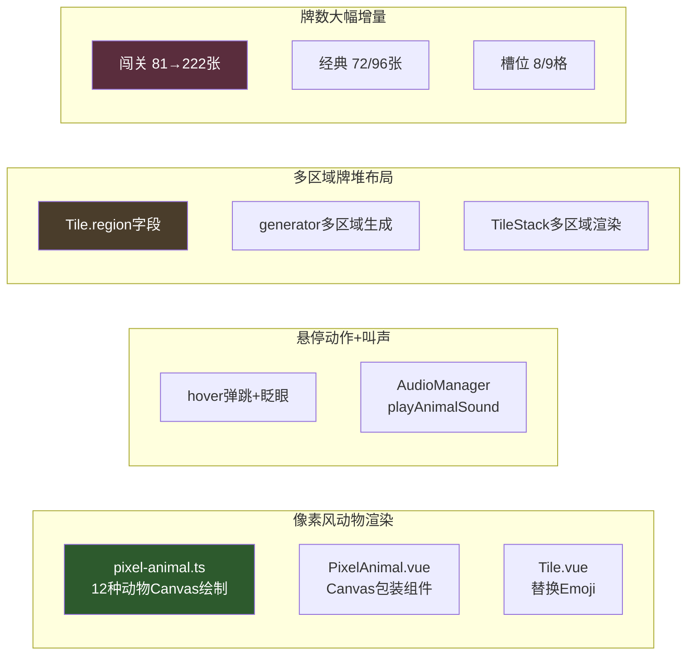
```mermaid
flowchart LR
    subgraph 像素动物["像素风动物渲染"]
        PA1["pixel-animal.ts<br/>12种动物Canvas绘制"]
        PA2["PixelAnimal.vue<br/>Canvas包装组件"]
        PA3["Tile.vue<br/>替换Emoji"]
    end

    subgraph 悬停互动["悬停动作+叫声"]
        HO1["hover弹跳+眨眼"]
        HO2["AudioManager<br/>playAnimalSound"]
    end

    subgraph 多区域["多区域牌堆布局"]
        MR1["Tile.region字段"]
        MR2["generator多区域生成"]
        MR3["TileStack多区域渲染"]
    end

    subgraph 牌数增量["牌数大幅增量"]
        TI1["闯关 81→222张"]
        TI2["经典 72/96张"]
        TI3["槽位 8/9格"]
    end

    style PA1 fill:#2d5a2d,color:#fff
    style MR1 fill:#4a3d2b,color:#fff
    style TI1 fill:#5a2d3d,color:#fff
```

### 13.2 像素风动物渲染系统

**新增文件**：
- `src/renderer/src/utils/pixel-animal.ts` - 12种动物的 Canvas 像素绘制函数
- `src/renderer/src/components/game/PixelAnimal.vue` - Canvas 包装组件

**渲染原理**：

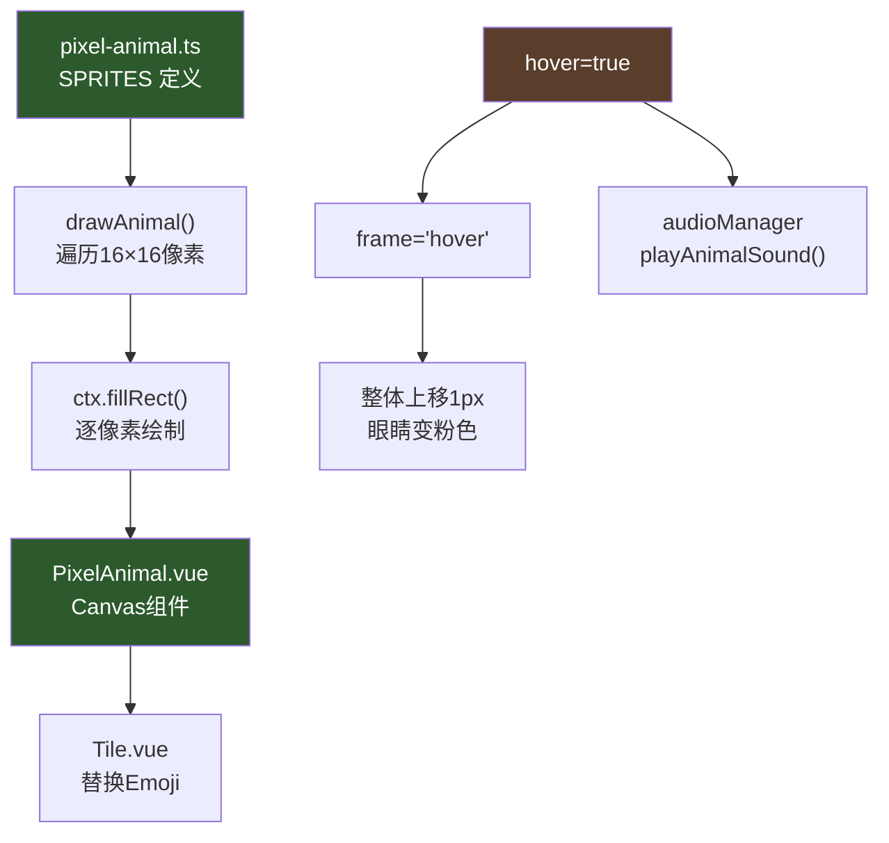
```mermaid
flowchart TB
    A["pixel-animal.ts<br/>SPRITES 定义"] --> B["drawAnimal()<br/>遍历16×16像素"]
    B --> C["ctx.fillRect()<br/>逐像素绘制"]
    C --> D["PixelAnimal.vue<br/>Canvas组件"]
    D --> E["Tile.vue<br/>替换Emoji"]

    F["hover=true"] --> G["frame='hover'"]
    G --> H["整体上移1px<br/>眼睛变粉色"]
    F --> I["audioManager<br/>playAnimalSound()"]

    style A fill:#2d5a2d,color:#fff
    style D fill:#2d5a2d,color:#fff
    style F fill:#5a3d2b,color:#fff
```

**像素图设计**：
- 16×16 像素网格
- 调色板系统：`K`黑/`W`白/`M`主色/`S`次色/`L`亮色/`P`粉/`E`眼/`B`嘴/`O`描边
- 每种动物定义 palette + pixels 数组
- variant 1 叠加小帽子

### 13.3 多区域牌堆布局

**布局结构**（5区域 CSS Grid）：

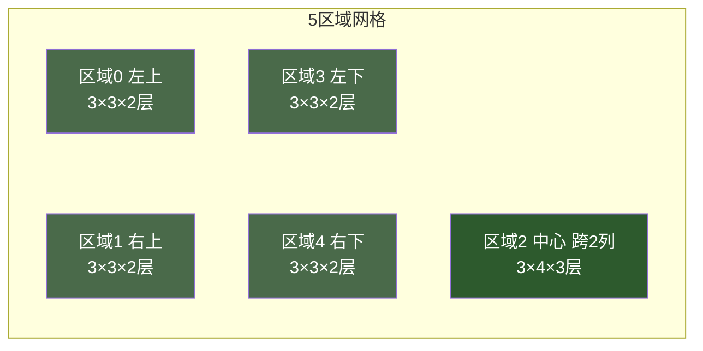
```mermaid
flowchart TB
    subgraph 多区域布局["5区域网格"]
        direction TB
        A["区域0 左上<br/>3×3×2层"]
        B["区域1 右上<br/>3×3×2层"]
        C["区域2 中心 跨2列<br/>3×4×3层"]
        D["区域3 左下<br/>3×3×2层"]
        E["区域4 右下<br/>3×3×2层"]
        A ~~~ B
        C
        D ~~~ E
    end

    style C fill:#2d5a2d,color:#fff
    style A fill:#4a6a4a,color:#fff
    style B fill:#4a6a4a,color:#fff
    style D fill:#4a6a4a,color:#fff
    style E fill:#4a6a4a,color:#fff
```

**数据流**：


```mermaid
flowchart LR
    A["LevelConfig.regions<br/>RegionConfig[]"] --> B["generator.ts<br/>distributeTilesToRegions()"]
    B --> C["每个区域<br/>独立generateRegionTiles()"]
    C --> D["Tile.region<br/>标识所属区域"]
    D --> E["TileStack.vue<br/>regionGroups分组"]
    E --> F["CSS Grid<br/>按区域排列"]

    style A fill:#4a3d2b,color:#fff
    style D fill:#4a3d2b,color:#fff
    style F fill:#2d5a2d,color:#fff
```

**覆盖关系**：coveredBy 仅在同区域内计算，不同区域之间不互相覆盖。

### 13.4 牌数与槽位变化

| 项目 | v1 | v2 |
|---|---|---|
| 闯关牌数范围 | 18→60 | 81→222 |
| 经典3消牌数 | 36 | 72 |
| 经典4消牌数 | 48 | 96 |
| 闯关槽位数 | 7 | 8 |
| 经典3消槽位 | 7 | 8 |
| 经典4消槽位 | 8 | 9 |
| 区域数 | 1 | 5 |

### 13.5 悬停互动系统

**交互流程**：

1. 鼠标进入 Tile → `handleMouseEnter()`
2. 设置 `isHover = true` → PixelAnimal 切换到 hover 帧（弹跳+眨眼）
3. 调用 `audioManager.playAnimalSound(animal)` → 播放对应动物叫声
4. 鼠标离开 → `isHover = false` → 恢复 idle 帧

**音效**：12种动物特征叫声，由 `ToneGenerator` 程序化生成（频率+波形+包络+颤音+噪声），无音频文件依赖。

### 13.6 向后兼容设计

- `LevelConfig.regions` 为可选字段，不填时走旧的单区域生成逻辑
- `TileStack.vue` 检测 `regionGroups.length`，单区域时走旧渲染路径
- `generator.ts` 双路径：有 regions 走多区域，无 regions 走旧逻辑

---

## 十四、v3 改动：24×24 像素图 + 全屏单大堆（2026-07-22）

### 14.1 改动总览

针对 v2 体验反馈的两个问题：
1. **动物特征不明显**：16×16 像素图太小，身体形状几乎一样
2. **画面依旧空**：5 区域之间有大间隙，每区域牌数少

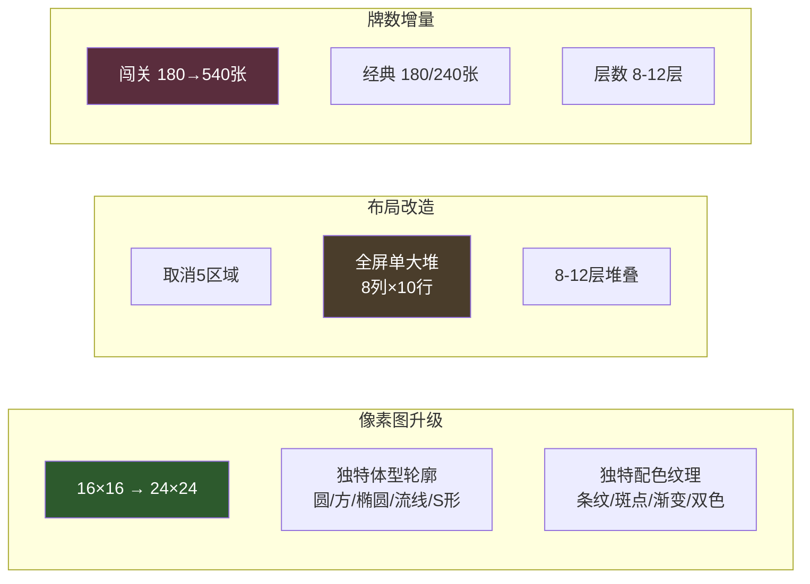
```mermaid
flowchart LR
    subgraph 像素升级["像素图升级"]
        P1["16×16 → 24×24"]
        P2["独特体型轮廓<br/>圆/方/椭圆/流线/S形"]
        P3["独特配色纹理<br/>条纹/斑点/渐变/双色"]
    end

    subgraph 布局改造["布局改造"]
        L1["取消5区域"]
        L2["全屏单大堆<br/>8列×10行"]
        L3["8-12层堆叠"]
    end

    subgraph 牌数增量["牌数增量"]
        T1["闯关 180→540张"]
        T2["经典 180/240张"]
        T3["层数 8-12层"]
    end

    style P1 fill:#2d5a2d,color:#fff
    style L2 fill:#4a3d2b,color:#fff
    style T1 fill:#5a2d3d,color:#fff
```

### 14.2 24×24 像素图设计

**12 种动物独特特征**：

| 动物 | 体型轮廓 | 配色纹理 | 辨识点 |
|---|---|---|---|
| 绵羊 | 圆形蓬松 | 白色卷毛纹理点 | 黑脸 + 卷毛 |
| 小鸡 | 圆胖 | 黄色 + 橙尖嘴 | 三角冠 |
| 小猫 | 椭圆+长尾 | 橙色条纹 | 竖三角耳 |
| 小狗 | 方形 | 棕色 + 红项圈 | 垂耳 |
| 兔子 | 高个 | 白色 | 超长耳 |
| 仓鼠 | 短胖 | 橙白双色 | 大颊囊 |
| 老虎 | 椭圆 | 橙色黑条纹 | 凶眉 |
| 小熊 | 圆肚 | 棕色 + 米色胸 | 圆耳 |
| 小鱼 | 流线型 | 蓝色鳞片 | 三角尾鳍 |
| 鲸鱼 | 大椭圆 | 蓝紫 + 白肚 | 喷水 |
| 小鸭 | 椭圆 | 黄色 + 扁嘴 | 翅膀 |
| 白鹅 | S形长脖 | 白色 | 长脖 |

### 14.3 全屏单大堆布局

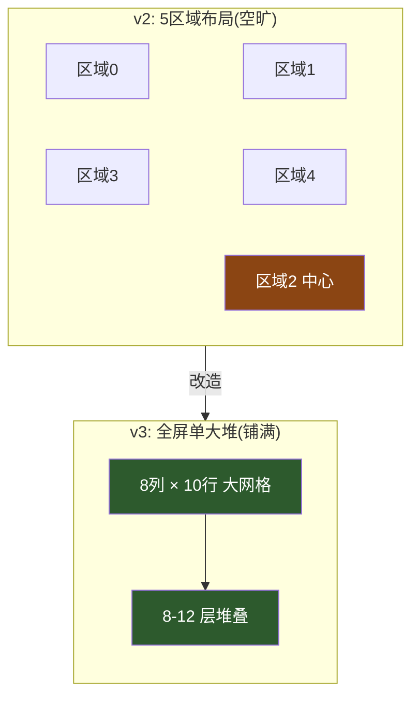
```mermaid
flowchart TB
    subgraph v2["v2: 5区域布局(空旷)"]
        direction LR
        A2["区域0"] ~~~ B2["区域1"]
        C2["区域2 中心"]
        D2["区域3"] ~~~ E2["区域4"]
    end

    subgraph v3["v3: 全屏单大堆(铺满)"]
        direction TB
        F["8列 × 10行 大网格"]
        G["8-12 层堆叠"]
        F --> G
    end

    v2 -->|改造| v3

    style C2 fill:#8b4513,color:#fff
    style F fill:#2d5a2d,color:#fff
    style G fill:#2d5a2d,color:#fff
```

**布局参数**：
- 网格：8 列 × 10 行 = 80 格
- 层数：8-12 层
- 牌数：180-540 张
- 牌面尺寸：64×68 px
- 层偏移：10px（每层向右下偏移）

### 14.4 牌数与层级变化

| 项目 | v2 | v3 |
|---|---|---|
| 闯关牌数范围 | 81→222 | 180→540 |
| 经典3消牌数 | 72 | 180 |
| 经典4消牌数 | 96 | 240 |
| 层数范围 | 3→5 | 8→12 |
| 布局方式 | 5区域 | 全屏单大堆 |
| 网格大小 | 3×3 / 3×4 | 8×10 |
| 像素图分辨率 | 16×16 | 24×24 |
| 牌面尺寸 | 48×52 px | 64×68 px |

### 14.5 改动文件清单

| 文件 | 改动 |
|---|---|
| `pixel-animal.ts` | 重写为 24×24 像素图，12种动物独特体型+纹理 |
| `PixelAnimal.vue` | 适配 24×24 尺寸，默认 size=56 |
| `Tile.vue` | 牌面 48×52→64×68，动物 36→52 |
| `generator.ts` | 改回单区域大网格生成器 |
| `levels.config.ts` | 牌数 180→540，层数 8→12，网格 8×10 |
| `engine.ts` | 经典模式 180/240 张 8 层 |
| `TileStack.vue` | 改回单区域渲染，支持大网格+滚动 |

---

## 十五、v4 改动：连击反馈系统 + 夸赞弹幕（2026-07-22）

### 15.1 改动总览

针对连击体验反馈，新增完整的"连击反馈系统"：
1. **连击数字分级变色**：根据 combo 数目分 7 档颜色 + 动画
2. **夸赞弹幕**：达到阈值时弹出 GOOD/NICE/GREAT/AMAZING/UNBELIEVABLE/GOD LIKE
3. **配合音效**：每个等级有对应音效文件

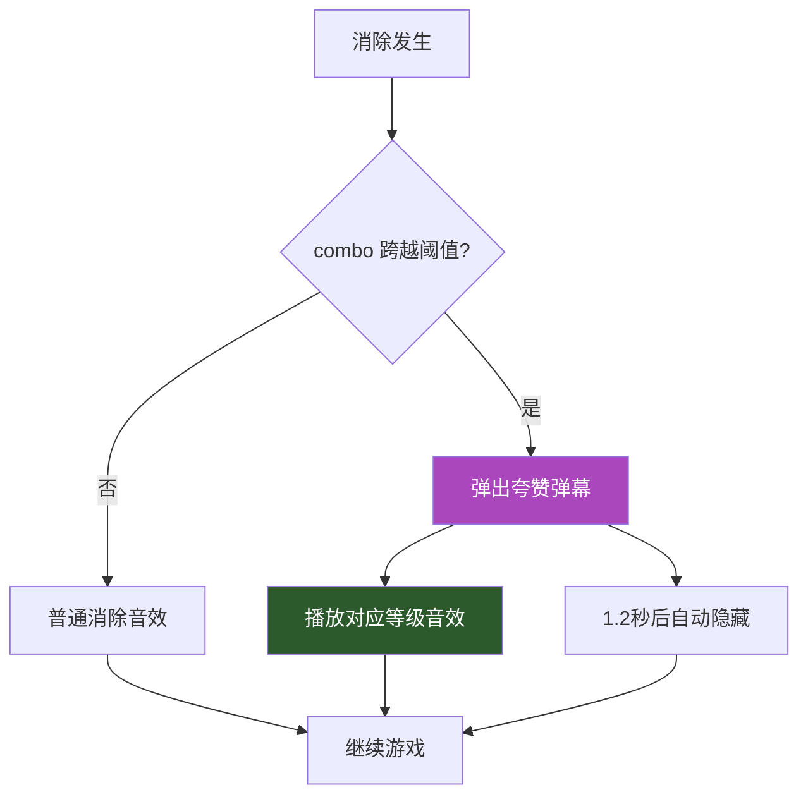
```mermaid
flowchart TB
    A[消除发生] --> B{combo 跨越阈值?}
    B -->|是| C[弹出夸赞弹幕]
    B -->|否| D[普通消除音效]
    C --> E[播放对应等级音效]
    C --> F[1.2秒后自动隐藏]
    D --> G[继续游戏]
    E --> G
    F --> G

    style C fill:#ab47bc,color:#fff
    style E fill:#2d5a2d,color:#fff
```

### 15.2 连击分级配色

```mermaid
flowchart LR
    subgraph 连击分级["7档连击配色"]
        L1["0-2 默认色<br/>18px"]
        L2["3-4 黄色<br/>20px + 阴影"]
        L3["5-6 橙色<br/>22px + 阴影"]
        L4["7-9 红色<br/>24px + 阴影"]
        L5["10-14 紫色<br/>26px + 阴影"]
        L6["15-19 金色<br/>28px + 发光动画"]
        L7["20+ 彩虹<br/>30px + 流光动画"]
    end

    style L6 fill:#ffd700,color:#000
    style L7 fill:#8b0000,color:#fff
```

### 15.3 夸赞阈值与文案

| combo 阈值 | 等级 tier | 夸赞文案 | 字号 | 配色 | 音效文件 |
|---|---|---|---|---|---|
| 3 | good | GOOD! | 48px | 黄 #ffd54f | sfx_combo_good.mp3 |
| 5 | nice | NICE! | 48px | 橙 #ffa726 | sfx_combo_nice.mp3 |
| 7 | great | GREAT! | 48px | 红橙 #ff7043 | sfx_combo_great.mp3 |
| 10 | amazing | AMAZING! | 56px | 紫 #ab47bc | sfx_combo_amazing.mp3 |
| 15 | unbelievable | UNBELIEVABLE! | 60px | 金 #ffd700 + 发光 | sfx_combo_unbelievable.mp3 |
| 20 | godlike | GOD LIKE! | 64px | 彩虹渐变 | sfx_combo_godlike.mp3 |

### 15.4 触发逻辑

**关键算法**：`getComboTierCrossed(prevCombo, curCombo)` 检测"首次跨越阈值"。

- combo 从 0→1：不弹幕
- combo 从 2→3：弹 GOOD!（首次达到 good 阈值）
- combo 从 3→4：不弹（仍在 good 等级内）
- combo 从 4→5：弹 NICE!（首次达到 nice 阈值）
- combo 从 5→6：不弹
- ...以此类推

**触发位置**：`game.ts` store 的 `pickTile` 方法中，在调用引擎 `pickTile` 后检测 `prevCombo → curCombo` 是否跨越阈值。

### 15.5 改动文件清单

| 文件 | 改动 |
|---|---|
| `audio/manager.ts` | 新增 ComboTier 类型、6个阈值常量、getComboTier/getComboTierCrossed 函数、playComboPraise 方法 |
| `components/game/ComboPraise.vue` | **新增** 夸赞弹幕组件，6档配色+动画 |
| `components/game/GameHUD.vue` | 连击数字分7档配色 + 字号递增 + 发光/彩虹动画 |
| `stores/game.ts` | 新增 comboPraise 响应式状态、hideComboPraise 方法、pickTile 中跨阈值检测 |
| `views/Game.vue` | 挂载 ComboPraise 组件 |
| `resources/README.md` | 新增 6 个连击夸赞音效文件说明 |

---

## 十六、v5 改动：真实音频文件 + 程序化回退（2026-07-22）

### 16.1 改动总览

针对"BGM难听 + 动物音效不像 + 主菜单无BGM无按钮音效"问题，从 Mixkit 下载真实音频文件，Howler 优先播放文件，缺失时回退到 ToneGenerator 程序化合成：

```mermaid
flowchart TB
    subgraph 问题["v4 存在问题"]
        P1["主菜单无BGM"]
        P2["按钮无hover音效"]
        P3["动物音效无特征"]
        P4["打包后无声音<br/>音频文件缺失"]
    end

    subgraph 方案["v5 解决方案"]
        S1["Mixkit 真实音频文件<br/>29个mp3随包打包"]
        S2["3种BGM<br/>Fun and Games / A Game / Sci-Fi Game"]
        S3["按钮hover/click音效"]
        S4["12种动物真实叫声"]
        S5["Howler优先播放文件<br/>file:// URL 加载"]
        S6["ToneGenerator 回退<br/>文件缺失时程序合成"]
    end

    P1 --> S2
    P2 --> S3
    P3 --> S4
    P4 --> S5
    S2 --> S1
    S3 --> S1
    S4 --> S1
    S5 -->|加载失败| S6

    style P4 fill:#8b0000,color:#fff
    style S1 fill:#2d5a2d,color:#fff
    style S4 fill:#5a3d2b,color:#fff
    style S6 fill:#5a3d2b,color:#fff
```

### 16.2 音频架构

```mermaid
flowchart LR
    subgraph 调用层["调用方"]
        UI["UI组件<br/>Home/Game/Tile/BaseButton"]
    end

    subgraph 管理层["AudioManager 单例"]
        AM["playBgm<br/>playSfx<br/>playAnimalSound<br/>playComboPraise<br/>playHover"]
    end

    subgraph 文件层["Howler.js 文件播放"]
        HL["loadHowl<br/>优先加载mp3文件"]
    end

    subgraph 程序层["ToneGenerator 程序生成"]
        TG["OscillatorNode<br/>GainNode<br/>BiquadFilter"]
    end

    UI --> AM
    AM -->|优先| HL
    HL -->|加载成功| PLAY1["播放文件"]
    HL -->|加载失败/超时| TG
    TG --> PLAY2["程序合成播放"]

    style AM fill:#3d5a3d,color:#fff
    style TG fill:#5a3d2b,color:#fff
    style HL fill:#4a3d7a,color:#fff
```

### 16.3 12种动物音效来源

从 Mixkit 下载真实动物录音，部分动物无专门录音使用相近音效替代：

| 动物 | Mixkit 音效名 | 真实/替代 | 时长 |
|---|---|---|---|
| 绵羊 | Cow moo | 替代（农场动物） | 0:02 |
| 小鸡 | Rooster crowing | 真实（鸡类） | 0:04 |
| 小猫 | Sweet kitty meow | 真实 | 0:01 |
| 小狗 | Dog barking twice | 真实 | 0:01 |
| 兔子 | Little bird calling chirp | 替代（小动物） | 0:01 |
| 仓鼠 | Crickets and insects | 替代（吱吱声） | - |
| 老虎 | Wild lion animal roar | 替代（大型猫科） | 0:01 |
| 小熊 | Aggressive beast roar | 替代（野兽吼叫） | 0:01 |
| 小鱼 | Water flowing | 替代（水声） | - |
| 鲸鱼 | Ocean ambience | 替代（海洋） | - |
| 小鸭 | Duck quack | 真实 | - |
| 白鹅 | Flock of wild geese | 真实 | 0:05 |

### 16.4 BGM 真实音乐文件

3种 BGM 从 Mixkit Free Stock Music 下载，Howler 设置 `loop: true` 循环播放：

| BGM | 曲名 | 作者 | 风格标签 | 时长 |
|---|---|---|---|---|
| home（主菜单） | Fun and Games | Ahjay Stelino | Humorous, Quirky, Fairytale, Flute | 2:19 |
| game（游戏中） | A Game | Michael Ramir C. | Propulsive, Driving, Electro House | 1:53 |
| level（闯关） | Sci-Fi Game | Arulo | Mysterious, Weird, Synth | 1:40 |

文件缺失时回退到 ToneGenerator 的 `startBgmLoop` 程序化循环（C-G-Am-F 等和弦进行）。

### 16.5 Howler 回退机制

```mermaid
sequenceDiagram
    participant UI as UI组件
    participant AM as AudioManager
    participant HL as Howler.loadHowl
    participant TG as ToneGenerator

    UI->>AM: playAnimalSound('sheep')
    AM->>HL: loadHowl('audio/animal_sheep.mp3')
    alt 文件存在
        HL-->>AM: Howl对象(loaded)
        AM->>HL: howl.play()
    else 文件缺失/加载失败/3秒超时
        HL-->>AM: null
        AM->>TG: playAnimalSound('sheep')
        TG->>TG: OscillatorNode合成
    end
```

**loadHowl 关键改进**：
1. 用 Promise 包裹 Howl 的 `onload`/`onloaderror` 事件，3秒超时兜底，确保文件缺失时正确返回 null 并回退到 ToneGenerator
2. 将本地路径转换为 `file:///` URL（Howler 加载本地文件需要 file 协议）
3. Windows 路径 `D:\...\file.mp3` → `file:///D:/.../file.mp3`

### 16.6 改动文件清单

| 文件 | 改动 |
|---|---|
| `resources/audio/*.mp3` | **新增** 29个真实音频文件（12动物+3BGM+14SFX），来源 Mixkit |
| `audio/manager.ts` | loadHowl 添加 file:// URL 转换，确保 Howler 正确加载本地文件 |
| `audio/tone-generator.ts` | 保留作为文件缺失时的程序化回退 |
| `resources/README.md` | 更新音频来源与许可说明，添加替代音效说明 |

---

## 十七、v6 改动：sql.js 迁移 + 点击失效修复（2026-07-23）

### 17.1 改动总览

针对两个关键问题进行了修复：
1. **数据库保存失败**：`better-sqlite3` 原生模块与 Electron 28 ABI 版本不兼容，迁移到纯 JavaScript 的 `sql.js`
2. **点击失效 Bug**：`getCoveringTiles` 未排除 `inSlot` 的 tile，导致槽位中的 tile 仍被认为是覆盖者

```mermaid
flowchart LR
    subgraph DB["数据库迁移"]
        D1["better-sqlite3<br/>原生模块 ABI 不兼容"]
        D2["sql.js<br/>纯 JavaScript 无需编译"]
        D3["DbWrapper + StmtWrapper<br/>API 兼容包装"]
        D4["saveToFile() 持久化<br/>每次写操作后自动保存"]
    end

    subgraph Bug["点击失效修复"]
        B1["getCoveringTiles<br/>只检查 removed"]
        B2["添加 !t.inSlot 过滤<br/>槽位 tile 不算覆盖者"]
        B3["canPick 逻辑修复<br/>视觉与逻辑一致性"]
    end

    D1 --> D2
    D2 --> D3
    D3 --> D4

    B1 --> B2
    B2 --> B3

    style D2 fill:#2d5a2d,color:#fff
    style B2 fill:#2d5a2d,color:#fff
```

### 17.2 sql.js 迁移详情

**问题根因**：系统 Node.js 22 编译的 `better-sqlite3`（NODE_MODULE_VERSION 127）与 Electron 28（v119）不兼容。`electron-rebuild` 编译后虽然能加载，但 `new Database()` 报 "unable to open database file"，无法创建数据库文件。

**解决方案**：迁移到 `sql.js`（纯 JavaScript SQLite 实现，基于 WASM）。

**关键改动**：

```mermaid
flowchart TB
    subgraph 数据层["数据层改动"]
        A["initDB() 改为异步<br/>await initSqlJs()"]
        B["DbWrapper 包装类<br/>（命名参数 → 位置参数）"]
        C["StmtWrapper 包装类<br/>prepare/run/get/all"]
        D["事务支持<br/>db.transaction()"]
        E["saveToFile() 持久化<br/>export → Buffer → writeFile"]
    end

    subgraph 打包["打包配置"]
        F["移除 better-sqlite3<br/>移除 @electron/rebuild"]
        G["添加 sql.js 依赖"]
        H["extraResources<br/>sql-wasm.wasm"]
    end

    style A fill:#3d5a3d,color:#fff
    style E fill:#5a3d2b,color:#fff
    style H fill:#4a3d7a,color:#fff
```

**DB 路径策略**：
- 开发模式：项目根目录 `data/` 文件夹
- 打包模式：`app.getPath('userData')`（`%APPDATA%\BeastGame\`）

### 17.3 点击失效修复

**问题根因**：`getCoveringTiles` 过滤条件为 `!t.removed`，未排除 `inSlot` 的 tile。当槽位中已有相同动物的 tile（如 dog），该 tile 虽然 `inSlot=true` 但 `removed=false`，仍被判定为 "覆盖者"，导致场上同名 tile 无法点击。

**修复**：在 `getCoveringTiles` 过滤条件中添加 `!t.inSlot`：

```typescript
// 修复前
.filter((t): t is Tile => !!t && !t.removed)

// 修复后
.filter((t): t is Tile => !!t && !t.removed && !t.inSlot)
```

**连带清理**：
- 移除所有 debug 日志（`console.log('[Tile]', ...)` 等）
- 关闭 DevTools（移除 `devTools: true` 和 `openDevTools()`）

### 17.4 改动文件清单

| 文件 | 改动 |
|---|---|
| `src/main/db/index.ts` | 完全重写：sql.js 初始化、DbWrapper/StmtWrapper 包装类、saveToFile() 持久化 |
| `src/main/db/repository.ts` | 每次写操作后调用 `saveDb()` 持久化 |
| `src/main/index.ts` | `initDB()` 改为 `await initDB()`，移除 DevTools |
| `src/game/matcher.ts` | `getCoveringTiles` 过滤条件添加 `!t.inSlot`，清理 debug 日志 |
| `src/game/engine.ts` | 清理 debug 日志 |
| `src/renderer/src/stores/game.ts` | 清理 debug 日志 |
| `src/renderer/src/components/game/Tile.vue` | 清理 debug 日志 |
| `src/renderer/src/components/game/TileStack.vue` | 清理 debug 日志 |
| `electron-builder.json` | 移除 better-sqlite3 配置，添加 sql-wasm.wasm |
| `package.json` | 移除 better-sqlite3、@electron/rebuild、@types/better-sqlite3，添加 sql.js |

---

## 十八、v7 改动：动物音效模式切换 + 真实音效更新（2026-07-23）⚠️ 已被 v8 替代

> **注意**：v7 的音效模式切换功能已在 v8 中移除。游戏内统一使用温和风铃音效，加载界面装饰动物使用真实动物叫声（点击触发）。此节保留作为历史记录。

### 18.1 改动总览（历史记录）

针对两个用户反馈进行改进：
1. **动物音效太吵**：添加音效模式切换，支持"真实音效"和"温和音效"两种模式
2. **新增动物音效不真实**：更新企鹅、狐狸、鹦鹉、火烈鸟、孔雀、熊猫等动物的程序化音效使其更贴近真实叫声

### 18.2 动物真实音效更新详情

| 动物 | 旧版问题 | 新版设计 | 关键技术 |
|---|---|---|---|
| 狐狸 (fox) | 单音符滑动，太简单 | 5个短促高频音符交替，模拟 yip-yip-yip | 方波，800→1500Hz 交替，60-80ms 短音 |
| 企鹅 (penguin) | 3个短促嘎嘎 | 3个中频音符带颤音，模拟 honk-bray 驴叫 | 方波，600→800Hz，6Hz 颤音 |
| 鹦鹉 (parrot) | 方波滑动 | 锯齿波高频多变，模拟 squawk 刺耳声 | 锯齿波，1000→1600Hz 交替，50-70ms |
| 孔雀 (peacock) | 简单滑动 | 响亮方波+颤音，模拟 may-aw 猫叫声 | 方波，700→1000→700Hz，4Hz 颤音 |
| 火烈鸟 (flamingo) | 正弦波优雅 | 方波中频有力，模拟 honk 鹅叫声 | 方波，700→800→900Hz，有力度 |
| 熊猫 (panda) | 三角波滑动 | 三角波+颤音，模拟 bleat 羊叫声 | 三角波，400→320Hz，8Hz 颤音 |

---

## 十九、v8 改动：统一温和音效 + 删除音效选择（2026-07-23）

### 19.1 改动总览

决定游戏内统一使用温和风铃音效，删除音效模式选择功能：

1. **游戏内统一温和音效**：消除时播放统一风铃音效（`playGentleClickSound()`），不再播放动物叫声
2. **删除音效选择功能**：移除 Settings.vue 中的「动物音效」设置区域，移除 settings.ts 中的 `animalSoundMode` 状态
3. **加载界面保留动物音效**：Home.vue 装饰动物点击播放真实动物叫声（`playDecorAnimalSound()`），不受游戏内音效统一影响
4. **连击音效仅在阈值触发**：`getComboTierCrossed` 检测首次达到 3/5/7/10/15/20 连击时触发对应等级音效

```mermaid
flowchart TB
    subgraph GameAudio["游戏内音效（统一温和）"]
        G1["消除成功"] --> GG["playGentleClickSound()<br/>风铃音色（三角波）"]
        G2["连击达到阈值"] --> GC["playComboPraise(tier)<br/>6档递增音效"]
        G3["点击无消除"] --> GS["playSfx('click')"]
    end

    subgraph DecorAudio["加载界面音效（真实动物）"]
        D1["点击装饰动物"] --> DG["playDecorAnimalSound(animal)<br/>真实叫声 + 程序化回退"]
    end

    style GG fill:#2d5a2d,color:#fff
    style DG fill:#4a3d7a,color:#fff
```

### 19.2 音效统一架构

```mermaid
flowchart LR
    subgraph Tile["Tile.vue"]
        T1["handleClick"]
    end

    subgraph Game["game.ts pickTile"]
        G1["消除成功"] --> G2["getComboTierCrossed"]
        G2 -->|跨阈值| G3["playComboPraise(tier)"]
        G2 --> G4["playGentleClickSound()"]
        G1 -->|未消除| G5["playSfx('click')"]
    end

    subgraph Home["Home.vue"]
        H1["handleDecorClick"] --> H2["playDecorAnimalSound(animal)"]
    end

    T1 --> G1
    H1 --> H2

    style G4 fill:#2d5a2d,color:#fff
    style G3 fill:#3d5a3d,color:#fff
```

### 19.3 改动文件清单

| 文件 | 改动 |
|---|---|
| `src/renderer/src/stores/game.ts` | 消除反馈统一使用 `playGentleClickSound()`；连击音效仅在 `getComboTierCrossed` 返回非空时触发 |
| `src/renderer/src/stores/settings.ts` | 删除 `animalSoundMode` 状态及相关方法，仅保留 `bgmVolume`/`sfxVolume` |
| `src/renderer/src/views/Settings.vue` | 删除「动物音效」设置区域（双按钮切换 UI） |
| `src/renderer/src/audio/manager.ts` | 删除 `AnimalSoundMode` 类型及 `setAnimalSoundMode`/`getAnimalSoundMode` 方法；新增 `playDecorAnimalSound()` 用于加载界面装饰动物 |
| `src/renderer/src/views/Home.vue` | 装饰动物音效改为点击触发（`playDecorAnimalSound`），不再使用 hover 触发 |

---

## 二十、v1.2.0 改动：章节机制 + 关卡平衡 + 点击数UI（2026-07-24）

### 20.1 改动总览

```mermaid
flowchart LR
    subgraph 机制["章节机制系统"]
        M1["5种机制<br/>moody/vine/sleepy/hidden/bubble"]
        M2["resolveMechanics<br/>消除后自动解除"]
        M3["getCoveringTiles<br/>覆盖判断一致性"]
    end

    subgraph 平衡["关卡平衡调整"]
        B1["前五章统一配置<br/>90/150/210/240/312张"]
        B2["第6章难度增加<br/>210/270/330/360/468张"]
        B3["层数6-13层<br/>轻快休闲节奏"]
    end

    subgraph UI["UI改进"]
        U1["点击数HUD居中<br/>颜色分级告急闪烁"]
        U2["返回按钮修复<br/>移除transition"]
    end

    style M1 fill:#2d5a2d,color:#fff
    style B1 fill:#4a3d2b,color:#fff
    style U1 fill:#3d4a7a,color:#fff
```

### 20.2 章节机制系统

每章 L3-L5 引入独特机制，增加策略深度：

| 章节 | 机制 | 效果 | L3比例 | L4比例 | L5比例 |
|---|---|---|---|---|---|
| 第1章 家畜 | 闹脾气 moody | 牌被乌云遮罩，消除一组后解除 | 30% | 40% | 40% |
| 第2章 野生 | 藤蔓 vine | 点击消耗次数，消除返还 | 30% | 40% | 40% |
| 第3章 森林 | 贪睡 sleepy | 牌在睡觉，消除一组后唤醒 | 30% | 40% | 40% |
| 第4章 鸟类 | 躲猫猫 hidden | 牌面隐藏，点击翻开 | 25% | 35% | 35% |
| 第5章 海洋 | 气泡 bubble | 点击消耗次数，消除返还 | 30% | 40% | 40% |
| 第6章 综合 | 混沌混合 | 随机混合前5章机制 | - | - | - |

**解析优先级**：消除后优先解除**未被上层牌遮挡的**闹脾气/贪睡牌，确保用户看到视觉反馈。

### 20.3 点击数 UI 改进

点击数（藤蔓/气泡机制）从 HUD 右侧隐藏位移到中央 `分数 | 点击数 | 连击 | 时长`：

| 剩余点击数 | 颜色 | 效果 |
|---|---|---|
| ≥ 30 | 翠绿 #43a047 | 光晕 |
| 16-30 | 蓝青 #00acc1 | 正常 |
| 6-15 | 橙黄 #fb8c00 | 字号放大 |
| 1-5 | 红色 #f44336 | 脉冲闪烁告急 |
| 0 | 灰色 | 已耗尽 |

### 20.4 关卡平衡

前五章统一配置（仅动物种类和机制不同），第六章难度增加约30%。详细数据见[第五节](#五30关章节结构v120)。

### 20.5 改动文件清单

| 文件 | 改动 |
|---|---|
| `src/game/types.ts` | 新增 MechanicState/MechanicType 类型 |
| `src/game/engine.ts` | resolveMechanics 机制解析 + getCoveringTiles 统一 |
| `src/game/levels.config.ts` | 5种章节机制配置 + 关卡平衡调整 |
| `src/game/generator.ts` | 牌面附加 mechanicState |
| `src/game/matcher.ts` | getCoveringTiles 排除 inSlot |
| `src/renderer/src/stores/game.ts` | lastResolvedMechanics 音效触发 |
| `src/renderer/src/components/game/GameHUD.vue` | 点击数居中 + 5档颜色分级 |
| `src/renderer/src/components/game/Tile.vue` | 机制遮罩 Canvas 渲染 |
| `src/renderer/src/components/game/MechanicIntro.vue` | 机制介绍弹窗 |
| `src/renderer/src/views/Game.vue` | 返回按钮修复 |
| `src/renderer/src/App.vue` | 移除 transition 白屏问题 |
| `src/main/index.ts` | DevTools 仅开发模式 |
| `src/main/db/repository.ts` | `DEFAULT_SETTINGS` 删除 `animalSoundMode` 字段 |

---

## 二十一、v9 改动：动物模型替换为图片素材 + 扩充至48种（2026-08-03）

### 21.1 改动总览

```mermaid
flowchart LR
    subgraph 素材["动物图片素材"]
        S1["static/ 静态图"]
        S2["active/ 悬停动态图"]
        S3["读取 shoulege-shou-animals-assets"]
    end

    subgraph 加载["图片加载管线"]
        L1["animal-image.ts<br/>抠图+裁剪+缓存"]
        L2["asset:resolve IPC<br/>打包/开发路径解析"]
    end

    subgraph 渲染["渲染集成"]
        R1["PixelAnimal.vue<br/>加载static/active"]
        R2["EarthGlobe.vue<br/>地球场景小动物"]
        R3["Tile.vue<br/>牌面显示"]
    end

    subgraph 扩展["扩充至48种"]
        E1["types.ts<br/>AnimalType 48种"]
        E2["levels.config.ts<br/>每章8种×6章"]
        E3["audio/manager.ts<br/>48种叫声映射"]
        E4["tone-generator.ts<br/>48种回退音效"]
    end

    S1 --> L1
    S2 --> L1
    L2 --> L1
    L1 --> R1
    L1 --> R2
    L1 --> R3
    E1 --> E2
    E2 --> E3
    E3 --> E4

    style S1 fill:#2d4a3e,color:#fff
    style L1 fill:#3d5a3d,color:#fff
    style R1 fill:#4a3d2b,color:#fff
    style E1 fill:#3d3a6a,color:#fff
```

**背景**：原动物使用 Canvas 程序化绘制的 24×24 像素风，用户反馈辨识度低、无法认出动物。本次改为使用真实图片素材（`shoulege-shou-animals-assets` 提供的 static/active 素材），并扩充动物种类至素材库全部48种。

### 21.2 动物图片素材

新增 `resources/animals/` 目录：

| 目录 | 内容 | 用途 |
|---|---|---|
| `static/` | 48张动物静态图（`{animal}.jpg`） | 牌面默认显示 |
| `active/` | 悬停动态图（`{animal}_active.jpg`） | 鼠标悬停时切换 |

素材为带浅色背景的 JPEG，加载时由 `animal-image.ts` 自动处理：
1. **抠透明**：以角落像素颜色为背景参考色，容差低于 `BG_TOLERANCE` 的像素设为透明
2. **裁剪主体**：计算非透明像素的边界，裁剪到动物主体范围
3. **缓存**：按 `(animal, folder)` 键缓存结果，避免重复处理

### 21.3 图片加载工具（animal-image.ts）

新增 `src/renderer/src/utils/animal-image.ts`：

| 函数 | 作用 |
|---|---|
| `getAnimalImage(animal, hover)` | 返回抠图后的透明、已裁剪的 canvas |

路径解析通过 Electron IPC `asset:resolve` 完成：
- **开发环境**：`app.getAppPath()/resources/animals`
- **打包环境**：`process.resourcesPath/animals`

### 21.4 动物扩充至48种

`AnimalType` 从 30 种扩充至 48 种，按 6 章 × 每章 8 种分配：

| 章节 | 动物 |
|---|---|
| 第1章 家畜 | sheep·pig·chicken·cow·horse·goat·duck·rooster |
| 第2章 野兽 | tiger·lion·bear·wolf·fox·zebra·camel·giraffe |
| 第3章 森林 | monkey·panda·deer·moose·kangaroo·koala·squirrel·raccoon |
| 第4章 小动物 | rabbit·cat·dog·otter·badger·beaver·hedgehog·skunk |
| 第5章 海洋 | fish·whale·dolphin·octopus·jellyfish·turtle·crab·seahorse |
| 第6章 综合 | hippo·rhino·elephant·frog·seal·owl·goose·penguin |

同步更新：
- `src/game/types.ts`：`AnimalType` 扩充至48种
- `src/game/levels.config.ts`：每章 8 种动物
- `src/renderer/src/audio/manager.ts`：`ANIMAL_SFX_MAP` 扩充至48种
- `src/renderer/src/audio/tone-generator.ts`：`ANIMAL_SOUND_SEQUENCES` 补齐48种回退音效

### 21.5 渲染集成

| 组件 | 改动 |
|---|---|
| `PixelAnimal.vue` | 由 Canvas 绘制像素图改为加载 static/active 图片素材 |
| `EarthGlobe.vue` | 地球场景小动物改为加载图片绘制 |
| `Tile.vue` | 牌面动物尺寸与显示匹配 |

### 21.6 清理已移除动物引用

移除旧版本中已被替换的动物（crocodile/flamingo/peacock/parrot/eagle/swan/boar/hare/meerkat/ostrich/shark/cheetah）在代码中的残留引用：
- `tone-generator.ts`：删除这些动物的特殊音效分支与音效序列
- `Levels.vue`：`FALLBACK_CHAPTERS` 与 `levels.config` 保持一致
- `db/index.ts`：移除未使用的 `Statement` 导入

### 21.7 改动文件清单

| 文件 | 改动 |
|---|---|
| `resources/animals/` | **新增** 动物图片素材（static 48张 + active 56张） |
| `src/renderer/src/utils/animal-image.ts` | **新增** 图片加载/抠图/裁剪/缓存工具 |
| `src/renderer/src/components/game/PixelAnimal.vue` | 改为加载图片素材 |
| `src/renderer/src/components/game/EarthGlobe.vue` | 地球场景小动物用图片绘制 |
| `src/renderer/src/utils/pixel-animal.ts` | 精简为辅助函数（背景色/名称/机制遮罩） |
| `src/game/types.ts` | `AnimalType` 扩充至48种 |
| `src/game/levels.config.ts` | 每章8种动物 |
| `src/renderer/src/audio/manager.ts` | `ANIMAL_SFX_MAP` 扩充至48种 |
| `src/renderer/src/audio/tone-generator.ts` | 补齐48种回退音效 + 清理残留 |
| `src/renderer/src/views/Levels.vue` | `FALLBACK_CHAPTERS` 同步更新 |
| `src/renderer/src/views/Home.vue` | 装饰动物音效适配 |
| `src/main/ipc/asset.ts` | 资源路径解析 IPC |
| `src/preload/index.ts` | 暴露 `asset.resolve` |
| `src/renderer/src/types/global.d.ts` | 声明 `window.gameAPI.asset` |
| `electron-builder.json` | `extraResources` 打包 animals 资源 |
| `scripts/generate-preview.ts` | 预览脚本改为读取图片素材 |
| `src/main/db/index.ts` | 移除未使用的 `Statement` 导入 |

---

## 二十二、v9.1 修复：动物卡片填满 + 图片预加载（2026-08-03）

### 22.1 问题背景

用户反馈两个视觉问题：
1. **部分动物模型不能填满整个卡片模块**：`PixelAnimal.vue` 用 `Math.min` 等比缩放居中，长条形或主体较小的动物会在卡片内留大片空白。
2. **进入游戏时动物模型慢慢加载**：`getAnimalImage` 首次渲染时才异步加载图片（读文件+抠图+裁剪），导致牌面卡片先空白、随后逐个出现。

### 22.2 修复方案

**问题1：动物填满卡片**

`PixelAnimal.vue` 缩放逻辑由 `Math.min`（contain，完整显示）改为"先 contain 再放大填充"：

- 宽高比接近的动物：放大到填满卡片，主体更饱满
- 长条形动物：放大到一边填满，但限制不超过 contain 的 1.5 倍，避免过度裁切关键特征

```mermaid
flowchart LR
    A["containScale = min(w/cw, h/ch)"] --> B["fillScale = max(w/cw, h/ch)"]
    B --> C["scale = min(fillScale, containScale*1.5)"]
    C --> D["居中绘制，填满卡片"]
```

**问题2：进入游戏前预加载图片**

- `animal-image.ts` 新增 `preloadAnimalImages(animals)`：批量预加载一组动物的 static + active 图片并写入缓存
- `stores/game.ts` 的 `startGame` 在设置 `engineState` 前，先获取本关动物集合（闯关模式取关卡配置，经典模式取 `makeDefaultConfig`）并预加载，保证进入游戏时所有牌面图片已就绪
- `engine.ts` 导出 `makeDefaultConfig`，供 store 获取经典模式动物集合

### 22.3 改动文件清单

| 文件 | 改动 |
|---|---|
| `src/renderer/src/components/game/PixelAnimal.vue` | 缩放逻辑改为填充模式，填满卡片 |
| `src/renderer/src/utils/animal-image.ts` | 新增 `preloadAnimalImages` 预加载函数 |
| `src/renderer/src/stores/game.ts` | `startGame` 进入游戏前预加载本关动物图片 |
| `src/game/engine.ts` | 导出 `makeDefaultConfig` |

## 二十三、v10 改动：选关页真3D球体地球 + AI 贴图美化（2026-08-03）

### 23.1 改动总览

原选关页地球为静态平面贴图，观感粗糙且缺乏立体感。本次将其重写为 **Three.js 真3D球体地球**，并使用 AI 图像生成（Seedream）产出卡通等距圆柱贴图，解决"地球太丑、旋转割裂"的问题。

```mermaid
flowchart LR
    A["EarthGlobe.vue<br/>Three.js WebGL"] --> B["真3D球体<br/>SphereGeometry"]
    B --> C["AI 卡通贴图<br/>earth_texture_cartoon_v7.jpg"]
    C --> D["边缘无缝融合<br/>makeSeamless"]
    B --> E["半透明云层"]
    B --> F["大气光晕"]
    B --> G["星空背景"]
    B --> H["6章节 emoji 标记"]
```

### 23.2 真3D地球渲染

- **渲染器**：`THREE.WebGLRenderer`（antialias + alpha 透明背景）
- **球体**：`SphereGeometry(1, 64, 64)` + `MeshPhongMaterial`，方向光 + 环境光保证立体感
- **云层**：程序化生成半透明云贴图（`makeCloudTexture`），缓慢漂移
- **大气光晕**：径向渐变发光精灵（`makeHaloTexture`），Additive 混合
- **星空**：随机亮点粒子（`addStars`）
- **交互**：拖动旋转（经度+纬度）、点击标记选章节、悬停标记播放章节动物叫声

### 23.3 AI 贴图美化

- 使用 Seedream 生成 **2:1 等距圆柱投影** 卡通地球贴图（2880×1440）
- 重点刻画可辨识的大陆轮廓（非洲/美洲/欧亚）+ 青蓝海洋 + 白色云层，风格Q萌
- 贴图文件：`resources/earth_texture_cartoon_v8.jpg`（多轮迭代 v5→v6→v7→v8，v8 为最终版：极点白色冰盖更自然、大陆更圆润Q萌、配色更清爽）
- **无缝处理**：`makeSeamless()` 双重处理——左右边缘交叉混色消除水平接缝 + 顶部/底部极点行融合为整行平均色，消除极点（上下边缘）畸变，保证球体旋转无接缝、极点干净

### 23.4 章节标记与旋转

- 6 章节标记（🏠🐾🌳🌿🌊⛰️）为 emoji 精灵，用经纬度→球面坐标算法贴附地球表面，随地球一起旋转
- 选中章节光环实时更新世界坐标（`updateMatrixWorld` 强制刷新矩阵）
- 切换章节时地球平滑旋转到对应标记（`rotateToChapter`）

### 23.5 改动文件清单

| 文件 | 改动 |
|---|---|
| `src/renderer/src/components/game/EarthGlobe.vue` | 重写为 Three.js 真3D球体地球，加载 v8 卡通贴图，`makeSeamless` 增加极点融合 |
| `resources/earth_texture_cartoon_v8.jpg` | **新增** AI 生成卡通等距圆柱地球贴图（极点白色冰盖、Q萌） |
| `preview/earth-preview.html` | 更新为 v7/v8 对比预览 |
| `scripts/gen-earth-preview.js` | 生成地球贴图球体预览页（含极点融合验证） |
| `scripts/serve.js` | 本地静态预览服务器（开发辅助） |

---

## 二十四、v11 改动：动物扩充至56种 + 地球贴图升级v9（2026-08-04）

### 24.1 改动总览

在 v9（48种）基础上，由 work 模式 agent 提供素材并扩充至 **56 种动物**，同时将地球贴图由 v8 升级到 v9（Seedream 重新生成），并生成 2 个章节机制解除视频。

```mermaid
flowchart LR
    A["work模式agent<br/>提供素材"] --> B["动物扩充至56种<br/>types/关卡/音频/名称"]
    A --> C["地球贴图v8→v9<br/>Seedream生成"]
    A --> D["机制解除视频<br/>moody/vine (Seedance)"]
    B --> E["8种新动物<br/>static+active图片"]
    C --> F["EarthGlobe.vue<br/>加载v9贴图"]
```

### 24.2 动物扩充至56种

- `AnimalType` 从 48 种扩充至 **56 种**，分布在 6 章（第2/3/5/6章各 +2 种，第1/4章不变），共 8 种新动物：
  - 第2章 野兽：`boar`（野猪）、`cheetah`（猎豹）
  - 第3章 森林：`meerkat`（猫鼬）、`hare`（野兔）
  - 第5章 海洋：`shark`（鲨鱼）、`crocodile`（鳄鱼）
  - 第6章 综合：`flamingo`（火烈鸟）、`ostrich`（鸵鸟）
- 新动物素材已放入 `resources/animals/static/{animal}.jpg` 与 `active/{animal}_active.jpg`（共 8 组）
- 同步更新：`ANIMAL_NAMES`（中文名）、`ANIMAL_SFX_MAP`（叫声文件名）、`ANIMAL_SOUND_SEQUENCES`（回退合成音效）

### 24.3 地球贴图升级 v9

- 地球贴图由 `earth_texture_cartoon_v8.jpg` 升级为 `earth_texture_cartoon_v9.jpg`（Seedream 重新生成，风格更饱满）
- `EarthGlobe.vue` 的 `loadEarthTexture` 改为加载 v9 贴图

### 24.4 机制解除视频（暂未集成）

- work 模式生成 2 个机制解除视频 `moody_resolve.mp4`、`vine_resolve.mp4`（Seedance），位于 `resources/mechanics/videos/`
- **当前未集成**：游戏内机制解除仍使用 CSS 动画（`drawMechanicResolved`），视频作为预留素材，待剩余 3 个机制视频补齐后统一集成播放逻辑

### 24.5 改动文件清单

| 文件 | 改动 |
|---|---|
| `src/game/types.ts` | `AnimalType` 扩充至56种 |
| `src/game/levels.config.ts` | 第2/3/5/6章各扩充至10种动物 |
| `src/renderer/src/utils/pixel-animal.ts` | `ANIMAL_NAMES` 新增8种中文名 |
| `src/renderer/src/audio/manager.ts` | `ANIMAL_SFX_MAP` 新增8种叫声映射 |
| `src/renderer/src/audio/tone-generator.ts` | `ANIMAL_SOUND_SEQUENCES` 新增8种回退音效 |
| `src/renderer/src/components/game/EarthGlobe.vue` | 贴图引用 v8→v9 |
| `resources/animals/static/` | 新增8张静态动物图 |
| `resources/animals/active/` | 新增8张悬停动态动物图 |
| `resources/earth_texture_cartoon_v9.jpg` | **新增** AI 卡通地球贴图 |
| `resources/mechanics/videos/` | **新增** 2个机制解除视频（暂未集成） |

---

## 二十五、v12 改动：游戏加载性能优化（2026-08-04）

### 25.1 问题背景

用户反馈：**进入游戏会出现"游戏加载中"界面，且停留很久，严重影响体验**。

根因分析：
- 动物/机制图片原始尺寸为 **1920×1920**，之前 `getAnimalImage`/`getMechanicImage` 用 `` 完整解码整幅大图后，再逐像素扫描抠图，解码与像素扫描开销大。
- `startGame` 在设置 `engineState` **之前** `await` 全部图片预加载完成，导致加载界面长时间停留。

### 25.2 优化方案

```mermaid
flowchart LR
    A["原: 解码1920x1920全图<br/>+逐像素扫描"] --> X["加载界面卡住<br/>长时间停留"]
    B["createImageBitmap + resize<br/>解码时直接缩小到128px"] --> C["抠图扫描量减少约200倍"]
    D["引擎 init 先行<br/>（不依赖图片）"] --> E["加载界面立即关闭"]
    F["图片后台预加载<br/>带1.5s超时兜底"] --> G["牌面图片快速填充"]
```

**优化1：解码时直接缩小（`animal-image.ts` / `mechanic-image.ts`）**

- 新增 `MAX_PROCESS_SIZE = 128`：抠图处理前先缩到最大边长 128px。
- 用 `createImageBitmap(blob, { resizeWidth, resizeHeight, resizeQuality: 'high' })` 从文件 `fetch` 后解码时**直接缩小**，避免解码 1920×1920 全尺寸大图（实测单张解码+resize 约 22ms）。
- 保留 `fetch`/`createImageBitmap` 失败时的回退：`` 加载后绘制到小 canvas，功能不受影响。

**优化2：引擎先初始化，图片后台预加载（`stores/game.ts`）**

- `startGame` 改为**先** `GameEngine.init` 设置 `engineState`（布局/绘图计算不依赖图片），让"加载中"界面立即关闭。
- 动物与机制图片改为**后台预加载**（不 `await` 阻塞），并加 `withTimeout` 1.5s 超时兜底；超时后剩余图片仍继续异步加载（命中缓存），牌面会快速填充。

### 25.3 实测效果

| 指标 | 优化前 | 优化后 |
|---|---|---|
| 进入游戏总耗时（导航→就绪） | 约 1.6s | 约 126ms |
| "游戏加载中"界面 | 可见约 1.6s | 几乎不显示（0 帧） |
| 牌面 180 个 tile 图片 | 逐个慢加载 | 后台预加载全部填充（180/180） |

### 25.4 改动文件清单

| 文件 | 改动 |
|---|---|
| `src/renderer/src/utils/animal-image.ts` | `createImageBitmap`+resize 解码时缩小到 128px，避免解码全尺寸大图 |
| `src/renderer/src/utils/mechanic-image.ts` | 同上，机制图解码优化 |
| `src/renderer/src/stores/game.ts` | `startGame` 引擎先 init、图片后台预加载（1.5s 超时兜底） |

### 25.5 机制难度平衡调整（2026-08-04）

用户反馈：**"小动物生气"机制可点击牌太少，消除后仍出现生气牌，导致卡关**。

根因：`moody`/`sleepy` 是**硬性阻挡机制**（带机制牌必须靠"消除一组自动解除 1 张"才能解锁），比例过高时场上可点击牌过少。

调整方案（`levels.config.ts`）：降低阻挡类机制比例。

| 位置 | 机制 | 原比例 | 现比例 |
|---|---|---|---|
| 第1章 L3 | 生气 moody | 0.30 | 0.18 |
| 第1章 L4/L5 | 生气 moody | 0.40 | 0.22 |
| 第3章 L3 | 贪睡 sleepy | 0.30 | 0.18 |
| 第3章 L4/L5 | 贪睡 sleepy | 0.40 | 0.22 |
| 混沌池 | moody/sleepy | 0.20 | 0.15 |
| 第6章 L3/L4 | 随机机制 | 0.20/0.25 | 0.15/0.18 |

效果：以第1章 L4（240 张）为例，生气牌从约 96 张降至约 53 张，实测可见生气牌约 10 张、可点击约 19 张，不再卡关。

> 其他机制（藤蔓/气泡/躲猫猫）为可主动解除机制，不属硬阻挡，无需调比例。
