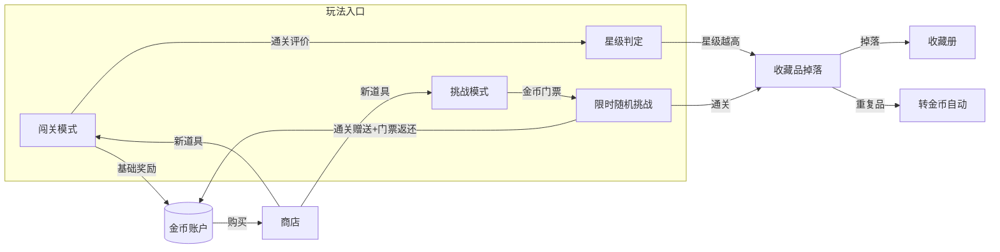
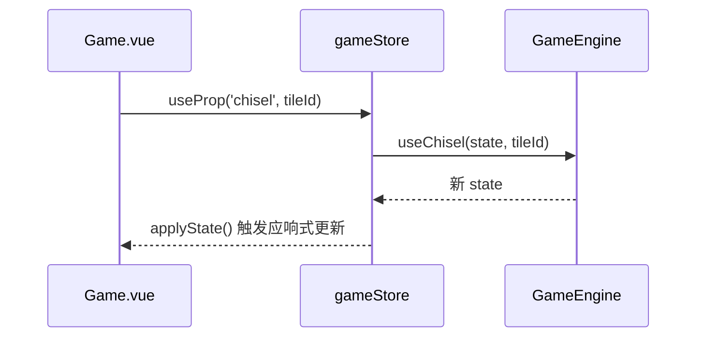

# 兽了个兽 · 成长系统设计文档

> 日期：2026-08-05
> 状态：待评审
> 范围：星级判定 / 新道具系统 / 商店系统 / 收藏品掉落 / 挑战模式

## 概述

在现有「经典3消 / 四消 / 闯关」基础上，新增 5 个相互联动的新系统，形成
「闯关/挑战 → 星级 → 金币+收藏品 → 消费/收集」的完整经济闭环。



## 1. 星级判定（多维综合评分）

### 现状问题
`calcStars` 仅按分数映射，且通关即存 `status='done'`，导致用户感觉"通关即满星"。

### 新规则
- 仅**通关（win）**参与星级，失败恒为 0 星。
- 星级由**多维加权**得出，映射到 0-3 星：

- 星级采用**分数主导乘数式**（已定案 2026-08-05）：分数决定星级上限，时间/道具/点击作为加成系数。

| 维度 | 说明 | 系数 |
|------|------|------|
| 本局分数 Score | 游戏内累计分数，决定星级上限 | 基准 0.4（乘数主体） |
| 剩余时间 Time | 通关剩余时间，单位秒 | 加成 0.2 |
| 道具使用 Props | 本局使用的撤回/洗牌/提示/新道具次数，越少越好 | 加成 0.2 |
| 剩余点击 Click | 藤蔓/气泡关剩余点击数，越多越好 | 加成 0.2 |

- 综合分（乘数式）`starScore = fScore * (0.4 + 0.2*fTime + 0.2*fProps + 0.2*fClick)`，∈ [0,1]
- 因 `0.4+0.2+0.2+0.2 = 1.0`，故 `starScore ≤ fScore` 恒成立：**分数不满则最高只能 2 星**（分数完全主导）。
- 星级映射：`0.85+ → 3星`，`0.6+ → 2星`，`0.3+ → 1星`，否则 0 星。
- 各维度的归一化基准（fScore 等）按关卡权重换算，保证低难度关也能拿到高星。

### 实现位置
- 新增纯逻辑函数 `calcStars(state, cfg)`（放 `scoring.ts` 或新 `stars.ts`）。
- `game.ts` 的 `updateLevelProgress` 改用新星级，并保留最高星级。

## 1b. 全员限时机制

**闯关模式所有关卡均限时**，超时即判负；Boss 关限时最短，L1 限时最长，依序递增。

| 关卡 | 限时 |
|------|------|
| L1 | 540 秒 |
| L2 | 510 秒 |
| L3 | 480 秒 |
| L4 | 450 秒 |
| L5（Boss） | 420 秒 |

- 各章统一采用上表时长（第 6 章综合关可微调更短）。
- 时长依据：实测通关约 7-9 分钟（420-540 秒），L1 留足约 9 分钟余量，Boss 关约 7 分钟，既有压力感又保证可通关。
- 实现要点：
  - `levels.config.ts` 为每关配置 `timeLimit`（不再仅 Boss 关）。
  - 引擎新增倒计时判定：`config.timeLimit` 存在时，`elapsed >= timeLimit` 且未通关 → `status='lost'`。
  - 游戏开始后由 `gameStore` 定时器驱动倒计时，结束时调用引擎强制判负，弹出结算弹窗。
  - `GameHUD` 显示剩余时间，接近耗尽时变红闪烁警示。
  - 星级判定中"剩余时间"维度直接取自倒计时剩余量。

## 2. 新道具系统（4 种）

现有道具：撤回/洗牌/提示（`GameProps`）。新增（仅闯关与挑战模式可用）：

| 道具 | 效果 | 定价(金币) |
|------|------|-----------|
| 拆牌锤 `chisel` | 直接移除一张指定牌（含被藤蔓/气泡困住的） | 120 |
| 槽位清空 `clear` | 一键清空当前槽位所有牌回牌堆 | 100 |
| 一键配对 `pair` | 直接消除场上某一对同动物牌 | 180 |
| 临时扩容槽 `slot` | 本局额外 +1 槽位 | 150 |

### 实现要点
- `GameProps` 扩展为 `{ undo, shuffle, hint, chisel, clear, pair, slot }`。
- 引擎新增对应操作：
  - `useChisel(tileId)`：标记该 tile `removed`，跳过入槽。
  - `useClear()`：槽位牌全部回牌堆（`inSlot=false`）。
  - `usePair()`：自动找一对可点击同动物牌直接消除。
  - `useSlot()`：`maxSlots+1`，`slots` 数组扩一格。
- 新道具**不进入** `history` 撤回序列（与洗牌一致），避免破坏撤回一致性。
- 视图层：`PropBar` 增加新道具按钮，点击后进入"选择目标"态（拆牌锤/一键配对需选牌）。

### 数据流


## 3. 商店系统

- 入口：Home 新增「商店」按钮，或闯关页内入口。
- 商品：4 种新道具，按上表定价，`金币` 结算。
- 购买后道具数量累加到玩家的持久化道具库存（存 `settings` 或新表）。
- 金币不足时置灰并提示。

### 持久化
新增表 `player_inventory`：
```sql
CREATE TABLE player_inventory (
  key   TEXT PRIMARY KEY,   -- 'coin' | 'prop_chisel' | 'prop_clear' | 'prop_pair' | 'prop_slot'
  value INTEGER NOT NULL DEFAULT 0
);
```

## 4. 收藏品掉落

- 收藏品总数 **56 件**（每只动物一件），按章节分组。
- 稀有度 4 档：普通 / 稀有 / 史诗 / 传说。
- 通关后按星级随机掉落，星级越高高稀有度概率越大：

| 星级 | 普通 | 稀有 | 史诗 | 传说 |
|------|------|------|------|------|
| 1 星 | 90% | 9%  | 1%   | 0%   |
| 2 星 | 60% | 30% | 9%   | 1%   |
| 3 星 | 30% | 40% | 25%  | 5%   |

- 掉落范围为**当前章**动物对应的收藏品。
- 重复收藏品**自动转金币**，价值尽量提高（普通 80 / 稀有 200 / 史诗 400 / 传说 800）。
- 收藏册视图：展示 56 件，已收集显示形象，未收集显示剪影，统计集齐进度。

### 持久化
新增表 `collection`：
```sql
CREATE TABLE collection (
  id      TEXT PRIMARY KEY,   -- 收藏品 id（如 'tiger'）
  rarity  TEXT NOT NULL,      -- 'common' | 'rare' | 'epic' | 'legend'
  count   INTEGER NOT NULL DEFAULT 0,  -- 累计获得次数
  obtained INTEGER NOT NULL DEFAULT 0  -- 是否已收集(≥1)
);
```

## 5. 挑战模式

- 入口：Home 新增「挑战」按钮。
- **金币门票制**：进入消耗 100 金币；通关返还门票并发放奖励。
- 玩法：随机组合动物 + 随机机制（前 5 章机制随机 1-2 种）+ 限时倒计时（比闯关更短）。
- 难度偏高，作为金币与收藏品的次要来源。
- 通关奖励：金币奖励 + 稳定掉落 1 件收藏品 + 额外道具。
- 失败：门票不返还。

### 配置
- 复用关卡生成器，动态生成 `LevelConfig`（随机 animals、随机 mechanic、timeLimit）。
- 新增 `GameMode = 'challenge'`。

## 数据库变更汇总

新增 2 张表：
1. `player_inventory`（金币 + 新道具库存）
2. `collection`（收藏品收集进度）

`game_records.mode` 增加 `'challenge'` 取值。

## 目录结构新增

```
src/game/
  stars.ts            # 星级判定（纯逻辑）
  props.config.ts     # 新道具定义与定价
  challenge.ts        # 挑战模式随机配置生成
src/renderer/src/
  stores/inventory.ts # 金币/库存 Store
  stores/collection.ts# 收藏品 Store
  views/Shop.vue      # 商店
  views/Collection.vue# 收藏册
  views/Challenge.vue # 挑战入口/结算
  components/game/PropBar 扩展
src/main/
  ipc/inventory.ts    # 金币/库存 IPC
  ipc/collection.ts   # 收藏品 IPC
```

## 分期实施计划

| 期 | 内容 | 依赖 |
|----|------|------|
| 期1 | 星级判定重构 + 数据库新增表 + 金币/库存基础 | 无 |
| 期2 | 新道具 4 种（引擎+视图+选择态） | 期1 |
| 期3 | 商店系统 | 期1、期2 |
| 期4 | 收藏品掉落 + 收藏册 | 期1 |
| 期5 | 挑战模式 | 期1、期2、期3 |

## 待确认项
- （无，核心决策已确认；数值可在实现中按体验微调）